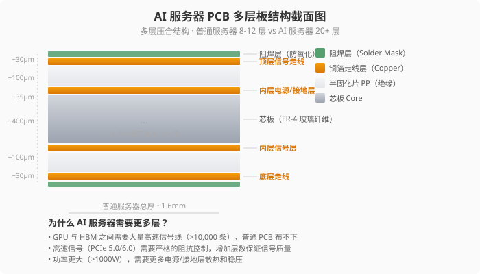

# 🔌 PCB与连接器——AI 服务器的"骨架"

> **写给小白看的PCB科普**，看完你就能理解：
>
> - PCB 到底是个什么东西，和封装有什么区别
>
> - AI 服务器的 PCB 为什么比普通服务器贵 3-5 倍
>
> - **全球谁技术最厉害？谁营收最大？差距在哪？**
>
> - 沪电股份、深南电路在全球格局中的位置

---

## 一、一句话说清 PCB 是什么

很多人把"封装"和"PCB"混在一起说，但它们是两个完全不同的东西：

```
芯片（裸 Die）          ── 就像一粒米
    ↓
封装（Packaging）       ── 把米煮成饭团，裹上保鲜膜
    ↓
PCB（印制电路板）        ── 把各种饭团放在一个托盘里，托盘上有"轨道"连接它们
    ↓
整机（服务器）           ── 把托盘装进餐盒
```

| 环节 | 做什么 | 对应到 AI 服务器 |
|:-----|:-------|:-----------------|
| **封装** | 把 GPU 芯片和 HBM 内存"粘"在一起（芯片级） | GPU + HBM → CoWoS 封装模组 |
| **PCB** | 把封装好的模组焊到电路板上（板级） | 把 GPU 卡、CPU、内存条连成一台机器 |

**PCB 的核心功能就三件事：** 承载所有零件、导电走线、隔离信号。

---

## 二、为什么 AI 服务器需要高端 PCB？

普通服务器的 PCB 和 AI 服务器的 PCB，虽然都叫"电路板"，但完全不是一个东西：

| 维度 | 普通服务器 PCB | AI 服务器 PCB | 差距 |
|:-----|:---------------|:--------------|:-----|
| **层数** | 8-16 层 | **20-30 层+** | 2-3 倍 |
| **材料** | FR-4 普通玻璃纤维（$5-10/平方英尺） | **M6/M7 级高频材料**（$30-80/平方英尺） | 5-10 倍 |
| **线宽/线距** | 100-150μm | **30-50μm** | 3-5 倍 |
| **单块价格** | $50-200 | **$500-2,000+** | **3-10 倍** |
| **良率** | 95%+ | **80-90%**（更难做） | 更低 |

> 💡 **为什么层数要多？** GPU 和 HBM 之间的信号几百 Gbps，需要多层电源/地层隔离干扰——就像高速公路要多建隔音墙。
>
> 💡 **为什么材料要贵？** 高频信号在普通玻璃纤维里会失真，需要用 PTFE/改性环氧树脂保证信号完整性。


*上图：AI 服务器 PCB 的层叠结构示意 — 普通服务器 8-12 层，AI 服务器需要 20 层以上。*

---

## 三、全球 PCB 市场有多大？

| 数据 | 数值 | 来源 |
|:----|:-----|:-----|
| **全球 PCB 市场（2025）** | **~$800 亿** | Prismark |
| **其中 AI 相关（2026E）** | ~$80-100 亿（高速增长） | TrendForce |
| **中国产值占比** | ~47%（全球第一，但高端~70%靠进口） | Prismark |
| **全球 PCB 增速（2024-2029）** | ~5% CAGR | Prismark |
| **AI 服务器 PCB 增速** | ~25%+ CAGR | 券商估算 |

> 💡 **核心认知：** 中国虽然占了全球近一半的PCB产值，但在最赚钱的高端AI PCB（20层+/IC载板）领域，**约70%的份额在台、日、欧企业手中**。

---

## 四、全球PCB竞争格局

### 排名一：按营收（谁最大）

| 公司 | 总部 | 上市代码 | 营收（2025E） | 全球地位 |
|:-----|:-----|:---------|:-------------|:---------|
| **臻鼎科技（鹏鼎控股）** | 🇹🇼 台湾 | A股：002938.SZ | **~$50亿** | 全球营收第一，苹果链为主 |
| **欣兴电子（Unimicron）** | 🇹🇼 台湾 | 台股：3037.TW | **~$40亿** | IC载板全球龙头 |
| **旗胜（Nippon Mektron）** | 🇯🇵 日本 | 东证NOK子公司 | ~$40亿 | 软板龙头 |
| **三星电机（SEMCO）** | 🇰🇷 韩国 | 韩股：009150.KS | ~$30亿 | IC载板/PCB |
| **Ibiden** | 🇯🇵 日本 | 东证：4062.T | ~$30亿 | 封装基板龙头 |
| **深南电路（SCC）** | 🇨🇳 中国 | A股：002916.SZ | ~$30亿 | PCB+IC载板国内领先 |
| **TTM Technologies** | 🇺🇸 美国 | 纳斯达克：TTMI | ~$25亿 | 北美最大PCB厂 |
| **奥特斯（AT&S）** | 🇦🇹 奥地利 | 维也纳：ATS.VI | ~$20亿 | 欧洲最大PCB厂 |
| **沪电股份（WUS）** | 🇨🇳 中国 | A股：002463.SZ | ~$18亿 | 国内高端PCB龙头 |

### 排名二：按技术水平（谁最厉害）

```
🏆 第一梯队（技术最顶尖，英伟达直接认证）
├── AT&S（奥地利）—— AI服务器高端PCB全球第一
├── Ibiden（日本）—— 封装基板技术全球最顶尖
└── 欣兴电子（台湾）—— IC载板营收+技术全球第一

🥈 第二梯队（技术先进，追赶中）
├── 沪电股份（中国）—— 国内AI PCB最领先，30层+量产能力
├── 深南电路（中国）—— PCB+IC载板双驱动，载板刚起步
├── 三星电机（韩国）—— IC载板技术不错
└── TTM Technologies（美国）—— 军工级技术，AI非核心

🥉 第三梯队（规模大，但技术不在最尖端）
├── 臻鼎/鹏鼎控股（台湾）—— 营收第一，但强在消费电子软板
├── 旗胜/Nippon Mektron（日本）—— 软板龙头，AI硬板不同赛道
```

### 关键技术差距在哪？

| 差距维度 | 🌍 全球龙头（AT&S/Ibiden/欣兴） | 🇨🇳 中国龙头（沪电/深南） |
|:---------|:-------------------------------|:------------------------|
| **最高量产层数** | **40 层+** | **~30 层** |
| **最小线宽/线距** | **25-30μm** | 35-50μm |
| **M7级高频材料良率** | **~90%+** | ~80-85% |
| **IC载板（FC-BGA）** | ✅ 已量产多年，英伟达核心供应商 | 深南刚起步，差距3-5年 |
| **英伟达供应关系** | **直接认证供应商** | 通过代工厂间接供应 |
| **AI PCB全球份额** | ~60% | ~15%（快速提升中） |

> 💡 **核心差距：** 中国PCB公司虽然营收规模不小，但在**最赚钱的高端AI PCB领域，技术水平和客户认证仍有明显代差**。沪电/深南是国内最领先的，但跟AT&S、Ibiden相比，在最高层数、最细线宽、IC载板等方面差距不小。

**数据来源：** Prismark《PCB Industry Outlook 2026》、N.T. Information、各公司年报

---

## 五、核心公司速览

### 🌍 全球龙头

**① AT&S（ATS.VI）** — 英伟达AI服务器PCB的直接核心供应商，能做40层+高端板，欧洲技术标杆。AI业务占比~40%，2025营收~€17亿。

**② 欣兴电子（3037.TW）** — 全球IC载板营收第一，英伟达AI芯片FC-BGA载板的核心供应商。2025营收~NT$1,300亿（~$40亿）。

**③ Ibiden（4062.T）** — 日本封装基板技术最顶尖，FC-BGA载板良率全球最高。英伟达/AMD高端AI芯片封装载板主要由Ibiden和欣兴供应。

**④ 臻鼎/鹏鼎控股（002938.SZ）** — 全球PCB营收第一（~$50亿），但~70%收入来自苹果链，AI PCB占比<10%。**营收最大≠AI PCB最强。**

**⑤ TTM Technologies（TTMI）** — 北美最大PCB厂，~60%收入来自军工/航天，AI服务器PCB非核心业务。

### 🇨🇳 中国核心标的

**⑥ 沪电股份（002463.SZ）** — A股AI服务器PCB弹性最大。30层+量产能力，国内最领先。英伟达/AMD间接供应商，通过广达/纬创等代工厂供货。2025利润+48%。

**⑦ 深南电路（002916.SZ）** — 国内唯一同时做高端PCB+IC载板的公司。FC-BGA载板国产替代先锋，但跟Ibiden/欣兴的IC载板技术差距仍有3-5年。2025利润+74%。

**⑧ 华丰科技（688629.SH）** — 高速背板连接器（112G/224Gbps），国内AI服务器连接器弹性最大。2025利润+2120%（基数低），需关注可持续性。

> ⚠️ **注意：** 这只是入门速览。每家公司详细分析需要单独的深度报告（待后续撰写）。

---

## 六、连接器——AI 服务器内部的"血管"

连接器就是各种"插头/插座"——GPU卡插到主板上用连接器，电源线和数据线也要用。

| 维度 | 普通服务器 | AI 服务器 | 差距 |
|:-----|:-----------|:----------|:-----|
| 单台连接器用量 | 200-300 个 | **800-1,500 个** | 3-5 倍 |
| 传输速率要求 | 25-56 Gbps | **112-224 Gbps** | 2-4 倍 |
| 连接器价值/台 | $200-500 | **$1,000-3,000** | 3-5 倍 |

**全球格局：** 安费诺（APH）、泰科电子（TEL）是全球连接器双寡头，各占~15%份额。A股的华丰科技是国内高速连接器龙头，受益于国产替代，但在全球份额仍很小。

---

## 七、投资逻辑

```
AI 芯片出货量增长
    ↓
AI 服务器出货量增长（每台PCB价值3-5倍于普通服务器）
    ↓
全球受益：AT&S、欣兴电子、Ibiden（技术领先，吃大头）
中国受益：沪电股份、深南电路（国产替代+跟随增长）
连接器：华丰科技（国内弹性最大）
```

**全球 vs 中国：不同投资逻辑**

| | 全球龙头（AT&S/欣兴） | 中国龙头（沪电/深南） |
|:--|:---------------------|:---------------------|
| **市场地位** | 技术主导，吃高端利润 | 国产替代，追赶中 |
| **AI弹性** | 高（直接供应英伟达） | 中高（间接供应+国产替代） |
| **护城河** | 技术+认证壁垒极高 | 成本+服务+响应速度 |
| **天花板** | 全球AI PCB市场 | 国内替代+逐步出海 |

---

## 八、风险

| 风险 | 怎么说 |
|:-----|:-------|
| **技术迭代** | PCB层数和材料要求不断升级，跟不上就被淘汰 |
| **客户集中** | 高度依赖英伟达/AMD的AI出货节奏 |
| **产能过剩** | 2025-2026集体扩产，若AI需求放缓，利用率下降 |
| **周期波动** | PCB是典型周期行业，2024年前经历2年下行期 |
| **地缘政治** | 高端材料/设备受限，供应链"去中国化"风险 |
| **华丰持续性** | +2120%利润增速基数太低，2026必然回落 |

---

## 九、一句话总结

> **AI 服务器出货量决定 PCB 需求——GPU 卖得越多，PCB 需求越大。**
>
> **技术最强：AT&S、Ibiden、欣兴电子（台/日/欧主导高端）**
>
> **营收最大：臻鼎（~$50亿），但AI PCB最强≠营收最大**
>
> **中国弹性：沪电股份（AI PCB）、深南电路（PCB+载板双驱动）**

---

> *免责声明：以上分析仅供参考，不构成投资建议。股市有风险，投资需谨慎。*

*数据来源：Prismark《PCB Industry Outlook 2026》、TrendForce（2025.12）、N.T. Information 全球PCB排名、Bishop & Associates、各公司 2025 年报*

*最后更新：2026-05-20 17:50（北京时间）*