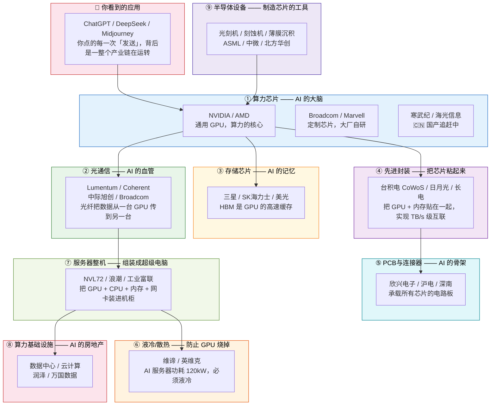

# 🤖 AI 产业链投资百科

> **给你一张图，看懂 AI 产业链的全貌——每一层是什么、为什么重要、中国在哪。**
>
> 适合小白入门 + 投资者参考。本网站所有分析仅为个人研究，不构成投资建议。

---

## 一张图看懂 AI 产业链

AI 不是一家公司能做完的。从你向 ChatGPT 提问，到 GPU 开始计算，中间经过 **9 个环节**——每一个环节都有对应的公司和投资机会。

---

## 每一层拆解：是什么 + 为什么重要 + 中国差距

### ① 🔵 算力芯片 — AI 的"大脑"

| 是什么 | 为什么重要 | 🇨🇳 中国差距 |
|:------|:----------|:------------|
| GPU（图形处理器）是 AI 训练和推理的核心硬件。一颗 H100 有 ~800 亿晶体管，每秒可以计算 ~2,000 万亿次。| 整个 AI 产业的底座。没有 GPU，ChatGPT、Midjourney 什么都跑不了。 | **巨大。** NVIDIA 占 ~80% 市场，CUDA 生态锁死了开发者。国产（寒武纪/海光）性能差距 ~3-5 年。 |

👉 [查看 NVIDIA 深度分析](算力芯片/nvda.md) · [AMD](算力芯片/amd.md) · [寒武纪](算力芯片/688256.md)

---

### ② 📡 光通信 — AI 的"血管"

| 是什么 | 为什么重要 | 🇨🇳 中国差距 |
|:------|:----------|:------------|
| AI 集群里有成千上万块 GPU，它们之间需要高速互联。光模块把电信号变成光信号，通过光纤传输，比铜缆快几百倍。 | GPU 集群越大，光通信需求越大。NVIDIA NVL72 需要 ~36 个 1.6T 光模块。 | ✅ **中国领先。** 中际旭创是全球光模块出货量第一，在 800G/1.6T 上不输海外。 |

👉 [查看光通信板块](光通信/index.md) · [中际旭创](光通信/中际旭创.md) · [Lumentum](光通信/lumentum.md)

---

### ③ 💾 存储芯片（HBM）— AI 的"记忆"

| 是什么 | 为什么重要 | 🇨🇳 中国差距 |
|:------|:----------|:------------|
| HBM（高带宽内存）是 GPU 的专用"高速缓存"。GPU 算得飞快，但内存喂不过来就会"饿死"。HBM 就是给 GPU 高速喂数据的通道。| 一颗 B200 GPU 需要配 6-8 颗 HBM，HBM 已占 AI 芯片成本的 ~30-40%。 | **巨大。** 三星/SK 海力士/美光三巨头垄断，中国（长鑫存储）差距 ~5 年。 |

👉 [查看三星分析](存储芯片/samsung.md) · [SK海力士](存储芯片/skhynix.md) · [美光](存储芯片/mu.md)

---

### ④ 🔬 先进封装 — 把芯片"粘"起来

| 是什么 | 为什么重要 | 🇨🇳 中国差距 |
|:------|:----------|:------------|
| 传统封装是把芯片单独封装再焊到 PCB 上。先进封装（CoWoS）是把 GPU + HBM 直接"贴"在一起，用硅中介层实现 TB/s 级互联。 | 没有 CoWoS，HBM 和 GPU 之间带宽不够，AI 芯片性能就被卡住。 | **巨大。** 台积电 CoWoS 独占 ~60%+ 市场，国内（长电/通富）做配套，技术差距 1-2 代。 |

👉 [查看先进封装板块](先进封装/index.md) · [台积电](先进封装/tsmc.md) · [长电科技](先进封装/600584.md)

---

### ⑤ 🔌 PCB 与连接器 — AI 的"骨架"

| 是什么 | 为什么重要 | 🇨🇳 中国差距 |
|:------|:----------|:------------|
| PCB（印刷电路板）是承载所有芯片的"电路板"。AI 服务器需要 20-30 层的超高密度板，单价是普通服务器的 4-6 倍。 | AI 服务器销量暴增 → 高端 PCB 需求暴增。沪电股份是 NVIDIA 认证供应商。 | ✅ **中国不差。** 全球最大 PCB 制造商是鹏鼎控股（台湾/中国），沪电/深南在高端 AI PCB 上处于领先。 |

👉 [查看 PCB 板块](PCB/index.md) · [沪电股份](PCB/002463.md) · [欣兴电子](PCB/unimicron.md)

---

### ⑥ 🌡️ 液冷/散热 — 防止 GPU 烧掉

| 是什么 | 为什么重要 | 🇨🇳 中国差距 |
|:------|:----------|:------------|
| 一台 NVL72 机柜功耗 = **120kW**≈ 120 个家用空调全开。传统风冷压不住，必须液冷。| 液冷不是升级，是**必须**。未来每一座 AI 数据中心都需要液冷改造。 | ✅ **差距不大。** 英维克是国内液冷龙头，维谛是全球老大，技术差距 ~2 年。 |

👉 [查看液冷板块](液冷/index.md) · [英维克](液冷/002837.md) · [维谛](液冷/vrt.md)

---

### ⑦ 🖥️ 服务器整机 — 组装"超级电脑"

| 是什么 | 为什么重要 | 🇨🇳 中国差距 |
|:------|:----------|:------------|
| 把 GPU、CPU、内存、网卡、电源全部装进一个机柜，做成一台可以直接交付的"AI 超级电脑"。NVIDIA NVL72 就是典型的 AI 服务器。| AI 训练需要几百台甚至上千台这样的服务器组成集群。 | ✅ **中国有份额。** 浪潮信息、工业富联是全球主要的 AI 服务器组装厂，但核心部件（GPU/CPU）全靠进口。 |

👉 [查看服务器板块](服务器/index.md) · [NVL72 拆解](服务器/nvl72.md)

---

### ⑧ 🏭 算力基础设施 — AI 的"房地产"

| 是什么 | 为什么重要 | 🇨🇳 中国差距 |
|:------|:----------|:------------|
| 数据中心是放 AI 服务器的"房子"。算力租赁是"出租算力"——客户不需要自己买服务器，按小时租就行。| AI 训练需要几千块 GPU 连续跑几周，数据中心需要稳定的电力、网络、散热。 | ✅ **中国不差。** 中国数据中心建设规模全球第二，但能耗效率落后于美国。 |

👉 [查看基础设施板块](算力基础设施/index.md)

---

### ⑨ 🛠️ 半导体设备 — 制造芯片的"工具"

| 是什么 | 为什么重要 | 🇨🇳 中国差距 |
|:------|:----------|:------------|
| 造芯片需要光刻机、刻蚀机、薄膜沉积设备。ASML 的 EUV 光刻机一台 ~$4 亿，全球只有它能造。| 没有这些设备，任何芯片都造不出来。AI 芯片需求暴增 → 设备需求暴增。 | **巨大。** 光刻机（ASML 垄断）差距 ~10 年+，刻蚀（中微）追赶中，差距 ~3-5 年。 |

👉 [查看光刻机入门](半导体设备/index.md)

---

## 📊 一张表看懂：每一层的投资逻辑

| 产业链层 | 全球霸主 | 中国对标 | 中美差距 | A 股有吗？ | 确定性 |
|:---------|:---------|:---------|:---------|:----------|:------|
| **① 算力芯片** | NVIDIA | 寒武纪/海光 | ❌ 巨大（3-5年）| ✅ 但性能差远 | ⭐⭐⭐ |
| **② 光通信** | Coherent/Lumentum | **中际旭创 🏆** | ✅ **中国领先** | ✅ **光模块龙头** | ⭐⭐⭐⭐⭐ |
| **③ 存储芯片** | 三星/SK海力士 | 长鑫/兆易 | ❌ 巨大（5年+）| ⚠️ 兆易（NOR Flash）| ⭐⭐ |
| **④ 先进封装** | 台积电 CoWoS | 长电/通富 | ❌ 1-2代 | ✅ 配套角色 | ⭐⭐⭐ |
| **⑤ PCB** | 欣兴/ibiden/AT&S | **沪电/深南** | ✅ **差距不大** | ✅ | ⭐⭐⭐⭐ |
| **⑥ 液冷** | 维谛 VRT | **英维克** | ✅ 差距 ~2年 | ✅ | ⭐⭐⭐⭐ |
| **⑦ 服务器** | NVIDIA（方案）| 浪潮/工业富联 | ⚠️ 组装可以，核心不行 | ✅ | ⭐⭐⭐ |
| **⑧ 基础设施** | Equinix | 万国/润泽 | ✅ 规模第二 | ✅ | ⭐⭐⭐ |
| **⑨ 半导体设备** | ASML/应用材料 | 中微/北方华创 | ❌ 巨大（5-10年）| ✅ 但卡脖子严重 | ⭐⭐ |

---

## 🔍 怎么用这个网站

| 你的目标 | 看什么 |
|:---------|:-------|
| **刚入门，想了解 AI 产业链全貌** | 👈 就从这页开始。选一个感兴趣的领域点进去 |
| **想对比几家公司，看哪个值得买** | 去 [全产业链对比](对比/index.md) 看横向估值和增速对比 |
| **深入了解某家公司** | 点击左侧导航栏具体的公司报告 |
| **只想看 A 股能买什么** | 看上面表格里「A股有吗？」列 ✅ 的就是 |

---

> *免责声明：所有分析仅供参考，不构成投资建议。股市有风险，投资需谨慎。*
