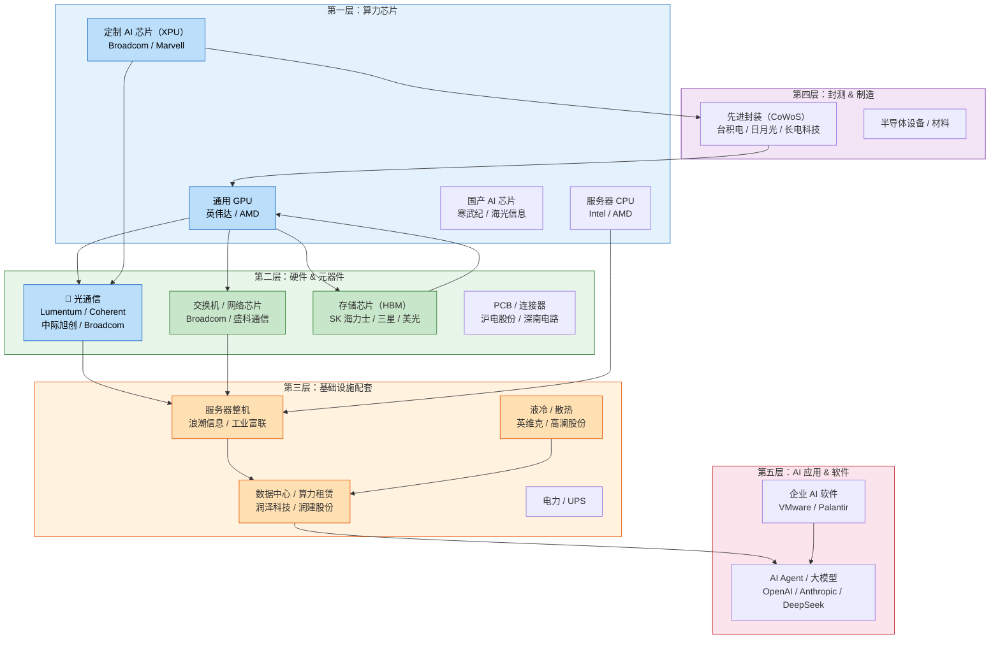

# AI 产业链投资分析

> 从芯片到应用，全景透视 AI 产业链，帮你理解每一家公司在"AI 食物链"中的位置。

---

## 产业链全景

AI 产业链可以分为 **五个层级**，从底层的算力芯片到上层的应用软件。你研究过的公司都分布在其中。

---

## 各领域速览

### 🔵 第一层：算力芯片 — AI 的大脑

| 细分赛道 | 核心公司 | 一句话理解 |
|:---------|:---------|:-----------|
| **通用 GPU** | 英伟达、AMD | AI 训练的"发动机"，英伟达占 ~80% 市场 |
| **定制 AI 芯片（XPU）** | **Broadcom**、Marvell | 大客户自己设计，Broadcom 负责造——Google TPU、Meta MTIA |
| **国产 AI 芯片** | 寒武纪、海光信息 | 性能追不上英伟达，但靠超节点集群化弥合差距 |

### 📡 第二层：硬件 & 元器件 — 骨架和血管

| 细分赛道 | 核心公司 | 一句话理解 |
|:---------|:---------|:-----------|
| **光通信** ✅ 已完成 | **Lumentum / Coherent / 中际旭创 / Broadcom** | 数据中心的"光纤血管"，详见 → [光通信板块](光通信/index.md) |
| **交换机芯片** | **Broadcom**、盛科通信 | GPU 集群的"神经中枢"，Broadcom 占 ~60-70% |
| **存储芯片（HBM）** | SK 海力士、三星、美光 | AI 芯片的"记忆体"，HBM 是增长最快的存储品类 |
| **PCB / 连接器** | 沪电股份、深南电路、华丰科技 | AI 服务器的"骨架"，用量随 GPU 集群扩张暴增 |

### 🌡️ 第三层：基础设施配套 — 能量和散热

| 细分赛道 | 核心公司 | 一句话理解 |
|:---------|:---------|:-----------|
| **液冷 / 散热** | 英维克、高澜股份 | GPU 功耗越来越高，风冷不够用了，液冷是必然趋势 |
| **服务器整机** | 浪潮信息、工业富联、中科曙光 | 把 GPU、CPU、内存装成整机——算力"代工厂" |
| **数据中心 / 算力租赁** | 润泽科技、万国数据、润建股份 | AI 算力的"房地产"——出租机房或直接出租算力 |
| **电力 / UPS** | — | AI 数据中心耗电惊人，电力配套是"隐形的受益者" |

### 🔬 第四层：封测 & 制造 — 把芯片做出来

| 细分赛道 | 核心公司 | 一句话理解 |
|:---------|:---------|:-----------|
| **先进封装（CoWoS）** | 台积电、日月光、长电科技 | AI 芯片需要把 GPU + HBM "粘"在一起，封装是关键 |
| **半导体设备** | ASML、应用材料 | 造芯片的"工具"，AI 芯片需求拉动设备支出 |

### 🎯 第五层：AI 应用 & 软件 — 变现端

| 细分赛道 | 核心公司 | 一句话理解 |
|:---------|:---------|:-----------|
| **大模型厂商** | OpenAI、Anthropic、DeepSeek | AI 能力的提供者，Token 的生产方 |
| **企业 AI 基础设施** | **Broadcom（VMware）** | 让企业能在自己的服务器上跑 AI 的软件平台 |
| **AI Agent / 应用** | — | AI 时代的"APP"——还在早期，百花齐放 |

---

## 📊 当前已覆盖公司一览

| 公司 | 代码 | 领域 | 产业链位置 | 分析状态 |
|:-----|:-----|:-----|:----------|:---------|
| **Lumentum** | LITE | 光通信 | 上游 EML 光芯片 | ✅ [已完成](光通信/lumentum.md) |
| **Coherent** | COHR | 光通信 | 全栈（芯片+模块+CPO） | ✅ [已完成](光通信/coherent.md) |
| **中际旭创** | 300308 | 光通信 | 中游光模块组装 | ✅ [已完成](光通信/中际旭创.md) |
| **Broadcom** | AVGO | 光通信 + 算力芯片 | DSP + 交换机 + AI 定制芯片 | ✅ [已完成](光通信/broadcom.md) |
| **英维克** | — | 液冷 | 数据中心散热 | 📝 待写 |
| **更多公司...** | — | — | — | 🚧 持续更新中 |

---

## 🔍 怎么用这个网站

| 你的目标 | 看什么 |
|:---------|:-------|
| **刚入门，想了解产业链全貌** | 先看首页这张全景图，选一个感兴趣的领域 |
| **想对比几家公司** | 去 [全产业链对比](对比/index.md) 看横向估值和增速对比 |
| **深入了解某家公司** | 点击左侧导航栏具体的公司报告 |
| **想知道投什么方向** | 关注每个领域的"产业链位置"分析，优先看上游客餐 |

---

> *免责声明：所有分析仅供参考，不构成投资建议。股市有风险，投资需谨慎。*
