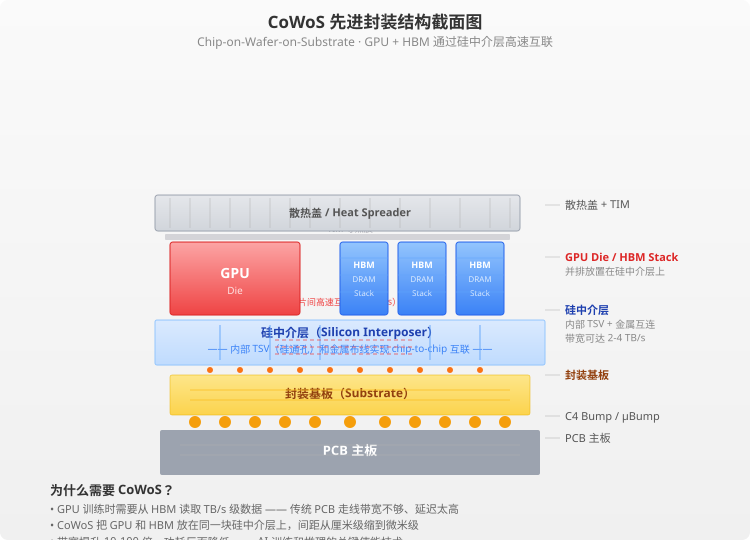
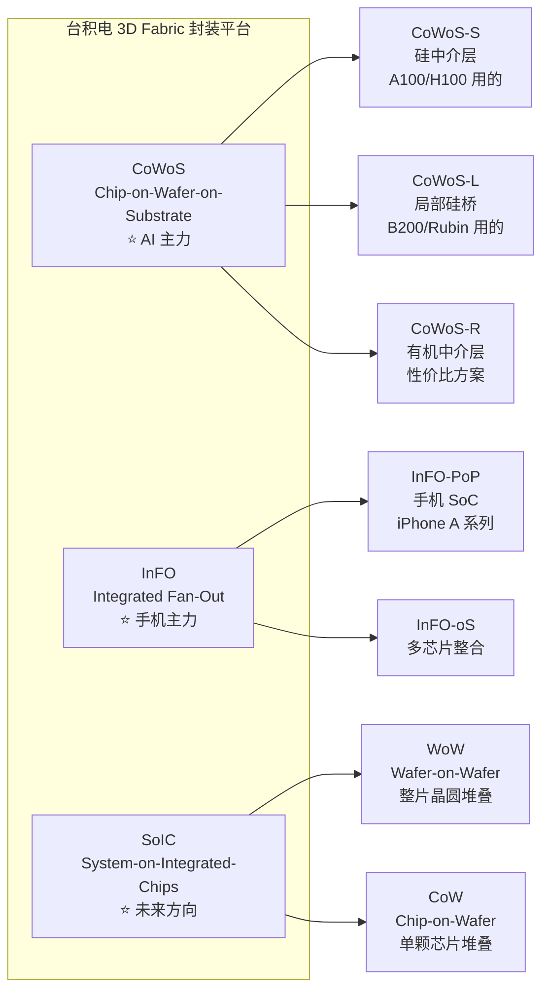

# 🔬 先进封装——AI 芯片的"黏合剂"

> **写给小白看的先进封装科普**，看完你就能理解：
>
> - 先进封装到底是什么——为什么 AI 芯片非它不可
> - CoWoS / InFO / SoIC 分别是什么、用在哪
> - 台积电为什么是先进封装的绝对霸主
> - 全球 OSAT（封测代工）格局：日月光、长电科技、Amkor 各在什么位置
> - 先进封装的投资逻辑：跟着台积电产能走

---

## 一、一句话说清：先进封装是什么

### 从一张图开始

```
传统封装：
  ┌──────┐          ┌──────┐
  │ GPU  │ ─── PCB ─→ │ HBM  │   距离远 → 速度慢、功耗高
  └──────┘          └──────┘

CoWoS 先进封装：
  ┌─────────────────────────┐
  │  GPU   │ HBM1 │ HBM2 │  │  ← 硅中介层（Silicon Interposer）
  └─────────────────────────┘  距离近 → 带宽大、功耗低
           ↓
      封装基板 → PCB
```

**先进封装，说白了就是把 GPU 和 HBM（高带宽内存）"粘"在一起，用硅中介层（Silicon Interposer）实现芯片之间的高速互联。**

这不同于传统的"先封装、再通过 PCB 走线连接"的方式——先进封装是在**晶圆级工艺**上直接把多个芯片集成到一起。

### 为什么叫"先进"？

| 维度 | 传统封装 | 先进封装 |
|:-----|:---------|:---------|
| **互联方式** | 引线键合（Wire Bond）/ 倒装焊（Flip Chip） | 硅中介层（Si Interposer）/ 硅桥（Si Bridge）/ 3D 堆叠 |
| **芯片间距** | 毫米级 | 微米级（<50μm） |
| **互联密度** | 几百条 I/O | 数万条 I/O |
| **带宽** | 几十 GB/s | **TB/s 级** |
| **功耗** | 高（信号要走远路） | 低（芯片挨着芯片） |

**关键认知：** 先进封装的本质是**晶圆级工艺**——用光刻、刻蚀、薄膜沉积等晶圆制造手段来做封装。它已经不是传统意义上的"封装"，而是**芯片制造的延伸**。

---

## 二、为什么 AI 需要先进封装？

### 核心痛点：内存墙（Memory Wall）

AI 训练的核心矛盾是：**GPU 算得太快，内存喂不过来。**

- GPU 的计算速度每年提升 40-60%
- 传统内存带宽每年只提升 10-20%
- 差距越拉越大 → **GPU 在等数据**，算力被浪费

### 高速公路的类比

| 技术 | 类比 | 带宽 |
|:-----|:-----|:-----|
| **传统封装 + PCB 走线** | 🛤️ 乡间小路 | 几十 GB/s |
| **CoWoS 硅中介层** | 🛣️ **8 车道高速** | **2-4 TB/s** |
| **HBM 直连（3D 堆叠）** | 🚄 **高铁专线** | HBM3E: ~1.2 TB/s 每颗 |

> 💡 **CoWoS 的核心价值：** 把 GPU 和 HBM 贴得尽可能近，中间用硅中介层走线——相当于把高速公路修到了 GPU 门口，数据不用绕远路。

### AI 芯片的需求场景

```text
AI 训练 → GPU 需要每秒钟读取 TB 级数据 → 需要极高带宽 → 需要 CoWoS
AI 推理 → 模型参数+KV Cache 需要大容量高速内存 → 需要 HBM + 先进封装
多芯片互联 → 需要把多个 GPU/ASIC 拼成一个大芯片 → 需要 SoIC 3D 堆叠
```

**没有先进封装，AI 芯片的性能就卡在「内存墙」上，GPU 算得再快也是白搭。**


*上图：CoWoS 封装结构截面 — GPU 与 HBM 通过硅中介层（Silicon Interposer）实现 TB/s 级芯片间互联，彻底摆脱传统 PCB 走线的带宽瓶颈。*

---

## 三、GPU 封装演进：从 A100 到 Rubin

每一代 NVIDIA GPU 的封装方式都在进化，直接反映了先进封装技术的迭代路径。

| GPU | 发布 | 封装方式 | GPU + HBM 组合 | 封装面积 |
|:----|:-----|:---------|:---------------|:---------|
| **NVIDIA A100** | 2020 | CoWoS-S | 1 GPU + 6 HBM2E | ~1.5× 掩模版 |
| **NVIDIA H100** | 2022 | CoWoS-S | 1 GPU + 6 HBM3 | ~1.5× 掩模版 |
| **NVIDIA H200** | 2023 | CoWoS-S | 1 GPU + 6 HBM3E | ~1.5× 掩模版 |
| **NVIDIA B200** | 2024 | **CoWoS-L** | 1 超大 GPU + 8 HBM3E | **~2× 掩模版** |
| **NVIDIA Rubin** | 2026 | **CoWoS-L / SoIC** | 多逻辑 Die + 更多 HBM4 | 接近信用卡大小 |
| **AMD MI300X** | 2023 | CoWoS + SoIC | 1 逻辑 Die + 8 HBM3 | 大芯片 |
| **AMD MI400** | 2026(预计) | CoWoS-L / SoIC | 更多 HBM4 堆叠 | 更大 |

### 技术路线图

```text
CoWoS-S (A100/H100)    硅中介层，整块硅做互联
    ↓
CoWoS-L (B200/Rubin)   局部硅桥 + 有机中介层，成本更低、灵活性更高
    ↓
SoIC (未来)             3D 堆叠，直接把芯片叠起来，互联密度最高
```

> **趋势很清晰：** GPU 越来越大、HBM 越来越多、封装越来越复杂。到 Rubin 时代，一颗芯片的封装面积接近 **一张信用卡的大小**，互联密度从每毫米几百根提升到数万根。

**数据来源：** NVIDIA GTC 各届 Keynote、AMD 官方技术文档、TSMC Technology Symposium（2024-2025）

---

## 四、台积电封装全家桶：CoWoS / InFO / SoIC

台积电（TSMC）是先进封装领域的绝对霸主，它通过 **3D Fabric** 平台整合了三条主要技术路线。

### 一张图看懂台积电封装技术



### 三大技术路线对比

| 维度 | **CoWoS** ⭐ | **InFO** | **SoIC** 🚀 |
|:-----|:-----------|:---------|:-----------|
| **一句话** | GPU + HBM 的"黏合剂" | 手机芯片的"省空间方案" | 3D 堆叠——把芯片叠起来 |
| **核心特点** | 硅中介层实现超高密度互联 | 扇出型封装，无硅中介层 | 直接 3D 堆叠，器件级互联 |
| **互联密度** | 几千-几万条/mm² | 几百条/mm² | **数十万条/mm²**（最高） |
| **典型应用** | **AI 加速卡（100%）** | iPhone SoC、射频前端 | 未来 AI 芯片、3D 堆叠 DRAM |
| **AI 相关度** | ⭐⭐⭐⭐⭐ | ⭐⭐ | ⭐⭐⭐⭐ |
| **主要客户** | NVIDIA、AMD、Google、Broadcom | 苹果、联发科、高通 | NVIDIA（未来）、AMD MI300 |

### 三者的关系

```
CoWoS = "平铺" —— 芯片并排摆，硅中介层连（2.5D 封装）
InFO  = "省钱" —— 不用硅中介层，用有机材料（扇出封装）
SoIC  = "叠起来" —— 芯片上下堆叠，最短的互联距离（3D 封装）
```

> **关键认知：** CoWoS 是目前 AI 芯片的绝对主力，SoIC 是下一代方向（3D 堆叠），InFO 主要服务手机市场。

**数据来源：** TSMC 2025 Technology Symposium、TSMC 3D Fabric 白皮书、TSMC 法说会

---

## 五、市场规模有多大？

### 全球先进封装市场整体规模

| 数据 | 数值 | 来源 |
|:----|:-----|:-----|
| **2025 年全球先进封装市场规模** | **~$460 亿** | Yole Group（2025.05） |
| **2029 年预计** | **~$780 亿** | Yole Group |
| **2024→2029 年 CAGR** | **~11-12%** | Yole Group |
| **CoWoS 占先进封装比重（2026E）** | **~35-40%**（AI 驱动增长最快） | TrendForce |
| **CoWoS 产能增长（2024→2025）** | **翻倍以上** | TSMC 法说会 |

### 先进封装 vs 传统封装增长

```text
传统封装市场（CAGR ~3-4%） → 平稳增长
先进封装市场（CAGR ~11-12%）→ 高速增长
    其中 AI 相关（CoWoS） → 每年翻倍

到 2029 年，先进封装占整体封装市场的比重
将从 ~45% 提升到 ~60% 以上
```

**数据来源：** Yole Group《Advanced Packaging 2025》、TrendForce、TSMC 季度法说会

---

## 六、全球 OSAT（封测代工）市场格局

### 2025 年封测市场排名

| 排名 | 公司 | 类型 | 2025 年市占率（估） | 定位 |
|:-----|:-----|:-----|:-------------------|:-----|
| 1️⃣ | **台积电（TSMC）** 🥇 | 晶圆厂+封装 | 先进封装 ~60%+ | **AI 封装绝对霸主，CoWoS 几乎垄断** |
| 2️⃣ | **日月光（ASX/3711.TW）** 🥈 | OSAT（纯封测） | 全球封测 ~30% | 全球最大封测厂，传统+先进都有 |
| 3️⃣ | **安靠/Amkor（AMKR）** 🥉 | OSAT | ~20% | 美系封测龙头 |
| 4️⃣ | **长电科技（600584）** | OSAT | ~12%（全球第三） | 国内第一，收购星科金朋后全球第三 |
| 5️⃣ | **通富微电（002156）** | OSAT | ~5-6% | 与 AMD 深度绑定 |

### 格局变化趋势

```
                           先进封装市场格局（2025E）
  ┌────────────────────────────────────────────────────┐
  │  TSMC（台积电）                                    │
  │  CoWoS 独占 ~60-65% 份额                          │
  │  ┌──────────────────────────────────────────────┐ │
  │  │ 客户: NVIDIA ~60% / AMD ~15% / Broadcom/    │ │
  │  │       Google/Marvell ~25%                   │ │
  │  └──────────────────────────────────────────────┘ │
  └────────────────────────────────────────────────────┘
              ↓    ↓    ↓    ↓
  日月光(ASE)   Amkor   长电科技(JCET)   通富微电(TFME)
  吃中高端剩余   吃配套   吃国产替代    绑AMD
```

> **关键格局认知：** 先进封装正在从"OSAT 的战场"变成"晶圆厂的战场"——台积电凭借 CoWoS 吃掉了 AI 封装最大的一块蛋糕，传统 OSAT（日月光、长电）更多吃中低端封装和部分先进封装配套。

**数据来源：** TrendForce（2025Q4 封测排名）、Yole Group、各公司年报

---

## 七、核心公司详解

### 🥇 台积电（TSMC）—— CoWoS 之王

**一句话：AI 封装 90%+ 的利润被台积电吃掉了。**

| 维度 | 内容 |
|:-----|:------|
| **封装技术** | CoWoS-S / CoWoS-L / CoWoS-R / InFO / SoIC（最全平台）|
| **CoWoS 产能（2025E）** | ~45-50 万片/年（12 寸等效），2026 年再翻倍 |
| **客户结构** | NVIDIA ~60%、AMD ~15%、Broadcom/Google/Marvell ~25% |
| **CoWoS 占封装收入（2025E）** | ~70% 以上，且加速增长 |
| **产能扩张** | 竹南、中科、嘉义三地扩产，2026 年底产能比 2024 年翻 3 倍 |
| **关键壁垒** | 硅中介层需要先进光刻 + 极高良率，别人做不了 |

**为什么别人做不了 CoWoS？**

```
CoWoS 的技术壁垒：
  1. 硅中介层需要 65nm/28nm 级光刻 → 只有晶圆厂有
  2. 硅通孔（TSV）工艺需要极高精度 → 良率是关键
  3. 大芯片封装（> 掩模版尺寸）需要拼接光刻 → 极少数晶圆厂能做
  4. 客户验证周期长（12-18 个月）→ 先发优势巨大
```

**投资逻辑：** 台积电是 AI 封装最确定的 winner。英伟达 Rubin / AMD MI400 / Google TPU v6 都需要 CoWoS 封装。只要 GPU 出货量增长，CoWoS 需求就增长。

**数据来源：** TSMC 2025 Q1-Q4 法说会、TrendForce、Morgan Stanley 研报

### 🥈 日月光投控（ASX/3711.TW）—— 全球最大封测厂

**一句话：传统封测的王者，也在往先进封装挤。**

| 维度 | 内容 |
|:-----|:------|
| **全球封测市占率** | ~30%（第一） |
| **先进封装进展** | FOCoS（Fan-Out Chip-on-Substrate）、VIPack 平台 |
| **AI 相关收入（2025E）** | ~20-25% 来自 AI 相关（CoWoS 配套、HBM 封装等） |
| **竞争压力** | 台积电在高端 CoWoS 上独占，日月光吃的是"中高端剩余市场" |
| **优势** | 封测种类最全、产能最大、客户最分散，抗风险能力强 |

**日月光 vs 台积电：**

```
台积电 CoWoS: 高端 AI 封装，单价高、毛利高（>50%）
日月光封测:    中高端封装，单价适中、毛利适中（~25-30%）

两者不是直接竞争 —— 台积电做最顶尖的 AI 封装，
日月光做剩下的大多数。AI 芯片出货量增长，
两者都会受益，但台积电受益幅度最大。
```

**数据来源：** ASE 2025 年年报、TrendForce

### 🥉 长电科技（600584）—— 国内封测龙头

**一句话：国内第一、全球第三，国产替代最大受益者。**

| 维度 | 内容 |
|:-----|:------|
| **全球排名** | 全球封测第三（约 12%），国内第一 |
| **核心能力** | 传统封装 + 先进封装（FC-BGA、SiP、2.5D/3D 封装） |
| **AI 相关** | HBM 封装配套、AI 芯片封装（国产 GPU/ASIC 客户）|
| **增长驱动** | ① 国产 AI 芯片放量→封测需求暴增 ② 先进封装自研突破 |
| **风险** | 先进封装技术落后台积电 1-2 代，毛利偏低 |

**为什么长电科技值得关注？**

```text
逻辑链条：
  美国制裁升级 → 国产 AI 芯片需求暴增
  → 国产 GPU/ASIC 需要封测配套
  → 长电科技是国内封测第一选择
  → 同时长电自己也在研发先进封装（2.5D/3D）
  → 既有确定性（国产替代），又有弹性（先进封装突破）
```

**数据来源：** TrendForce 封测排名、长电科技 2025 年半年报

### 其他值得关注的封装公司

| 公司 | 定位 | 看点 |
|:-----|:------|:-----|
| **Amkor（AMKR）** 🥉 | 美系封测老二 | 苹果 SiP 封装主力，CoWoS 配套参与 |
| **通富微电（002156）** | AMD 封测伙伴 | 与 AMD 深度绑定，收入 ~70% 来自 AMD |
| **盛合晶微（-）** | 中芯系封装 | 先进封装国产替代力量（未上市）|

---

## 八、投资逻辑：跟着台积电产能走

### 核心框架

```text
AI 芯片出货量增长
    ↓
台积电 CoWoS 产能 → 供不应求 → 持续扩产
    ↓                          ↓
  直接受益                间接受益
  ┌─────────────┐     ┌──────────────────┐
  │ 台积电(TSMC) │     │ 日月光(ASX)       │
  │ CoWoS 垄断   │     │ CoWoS 配套+中端封测 │
  │ 定价权最强   │     │ 长电科技(600584)     │
  └─────────────┘     │ 国产替代逻辑     │
                       │ 通富微电(002156)    │
                       │ 与 AMD 绑定      │
                       └──────────────────┘
```

### 按驱动力分类

| 驱动力 | 受益方向 | 核心标的 |
|:-------|:---------|:---------|
| **AI 训练芯片出货量增长** | 台积电 CoWoS | **台积电（美股/台股）** |
| **CoWoS 配套需求** | 日月光、Amkor | **日月光、Amkor** |
| **国产 AI 芯片放量** | 国产封装 | **长电科技**、通富微电 |
| **HBM 封装需求** | 存储厂商 | SK 海力士、三星、美光 |
| **先进封装设备** | 封装设备 | 迪斯科（Disco）、东京电子 |

### 周期视角

```
先进封装 vs 传统封测的周期差异：

传统封测：强周期（2-3 年一轮，受手机/PC 需求影响大）
先进封装：弱周期 + 结构性增长（AI 需求拉动，不受消费电子影响）

→ 先进封装公司的业绩波动更小，成长性更强
→ 头部公司（台积电 CoWoS）应享受更高估值
```

---

## 九、风险也要知道

| 风险 | 怎么说 |
|:-----|:-------|
| **技术迭代快** | CoWoS → CoWoS-L → SoIC 路线变化快，技术落后的公司可能被淘汰 |
| **客户集中度高** | 台积电 CoWoS 约 60% 收入来自 NVIDIA，一旦 NVIDIA 转向自研封装，冲击巨大 |
| **台积电一家独大** | 台积电的 CoWoS 垄断地位让其他封测厂很难分到大蛋糕 |
| **先进封装良率挑战** | 超大芯片（> 掩模版尺寸）的封装良率仍有挑战，可能影响产能爬坡 |
| **扩产不及预期** | CoWoS 扩产需要高端设备（光刻机、刻蚀机），设备交期长可能限制产能 |
| **地缘政治** | 美国对华半导体管制可能影响长电科技/通富微电的先进封装设备采购 |
| **估值透支** | 部分封测 A 股已经 Price In 了未来 2-3 年的增长预期 |

---

## 十、一句话总结

> **AI 芯片卖得越多，先进封装的需求就越大。**
>
> **台积电（CoWoS 垄断）是最确定的 winner，A 股看长电科技（国产替代逻辑）；**
>
> **日月光和 Amkor 吃配套，通富微电绑 AMD。**
>
> **跟着台积电产能走——CoWoS 产能翻倍，就意味着整个产业链都在增长。**

---

> *免责声明：以上分析仅供参考，不构成投资建议。股市有风险，投资需谨慎。*

*数据来源：TSMC 法说会（2025）、TrendForce（2025Q4-2026Q1）、Yole Group《Advanced Packaging 2025》、ASE/长电科技 2025 年年报、Morgan Stanley/高盛研报汇总*

*最后更新：2026-05-26 15:39（北京时间）*
