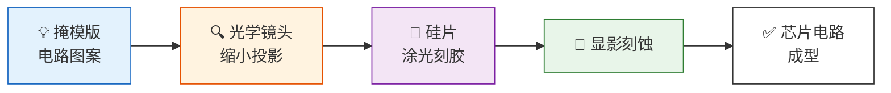
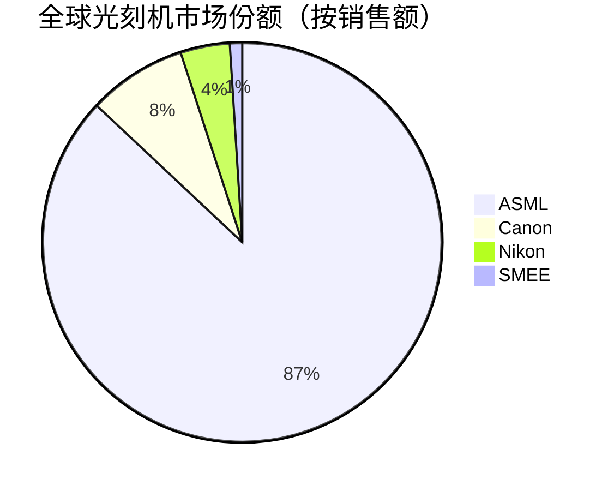
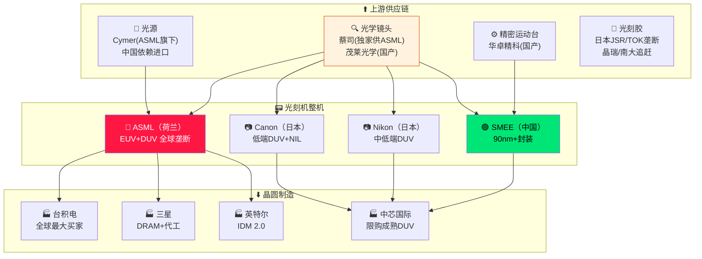

# 🛠️ 半导体设备——芯片是怎么"印"出来的

> **写给小白看的光刻机科普**，看完你就能理解：
>
> - 光刻机到底干什么的，为什么价值几亿美元一台
> - EUV 和 DUV 到底有什么区别
> - 荷兰 ASML 凭什么垄断全球高端光刻机市场
> - 上海微电子（SMEE）跟 ASML 差距多大，中国追赶到了哪一步
> - 光刻机相关的投资方向和关键公司

## 一、光刻机到底是干什么的？

**一句话：光刻机就是一台纳米级超高精度投影仪。**

芯片制造的本质，是把设计好的电路图"印"到硅片上。光刻机就是干这个活的：

> **掩模版（底片）→ 光学镜头系统 → 把电路图案缩小投射到硅片表面的光刻胶上 → 显影/刻蚀 → 图案刻到硅片上**

你常听到的"7nm、5nm、3nm"工艺节点，**核心就是光刻机能印多细的线**。线越细，同样面积的芯片里能塞的晶体管越多，性能越强、功耗越低。

## 二、光刻技术演进路线

光刻机的技术史，就是**波长越来越短、线宽越来越细**的历史。

| 世代 | 光源波长 | 典型工艺节点 | 活跃年代 | 一句话 |
|:----:|:---------|:------------|:--------|:-------|
| **i-line** | 365nm（汞灯） | ≥ 350nm | 90年代 | 古董级，现在老传感器还在用 |
| **KrF** | 248nm（准分子激光） | 250nm → 130nm | 2000年前后 | 成熟技术，功率器件/模拟芯片还在用 |
| **ArF 干式** | 193nm | 130nm → 65nm | 2000年代中期 | DUV 时代主力 |
| **ArF 浸没式** | 193nm（镜头泡水，等效134nm） | **65nm → 7nm**（配合多重曝光） | 2010年代至今 | **DUV 终极形态，目前最广泛的高端设备** |
| **EUV** | **13.5nm** | **7nm → 3nm** | 2020年代至今 | **当今最先进，做手机CPU/AI芯片的必需品** |
| **High-NA EUV** | 13.5nm（数值孔径 0.33→0.55） | **2nm 及以下** | 2025年起 | **下一代，单台造价超5亿美元** |

> **📌 关键名词**：
> - **DUV**（Deep UltraViolet，深紫外）= KrF + ArF 系列的总称
> - **EUV**（Extreme UltraViolet，极紫外）= 13.5nm 全新光源，7nm 以下工艺必须用
> - **浸没式** = 镜头和硅片之间注一层纯水，等效缩短波长，是 DUV 的"超频玩法"

## 三、EUV vs DUV：核心区别一张表看懂

| 对比维度 | DUV（ArF浸没式） | EUV（极紫外） |
|:--------|:----------------|:-------------|
| **光源波长** | 193nm（深紫外） | **13.5nm**（只有1/14） |
| **光学系统** | 透镜（透射式） | **多层钼/硅反射镜**（反射式）—— EUV 能被空气吸收，必须在真空中反射 |
| **光源怎么产生** | 准分子激光器（成熟技术） | 用超高功率 CO₂ 激光轰击锡滴产生等离子体，极其复杂，功耗~30kW |
| **工作环境** | 常压空气或惰性气体 | **超高真空**（空气会吸收 EUV） |
| **单台造价** | **~6000万美元** | **3~4亿美元**（High-NA 超过5亿） |
| **单次曝光分辨率** | ~38nm 极限（靠多重曝光做到7nm） | ~13nm（一次搞定7nm以下） |
| **主要使用方** | 几乎所有晶圆厂 | 仅台积电、三星、英特尔、SK海力士 |
| **年产量** | 数百台 | 约40~50台 |

> 💡 **简单记**：EUV 就是光刻机里的"光刻机"——一台 3 亿美元起步，全球 95% 以上的先进芯片都靠它生产。

## 四、全球光刻机市场格局

这是一个**高度垄断**的市场，三家日本+荷兰公司吃掉了全球几乎全部份额：

| 公司 | 国家 | 地位 | 市场销售额份额 |
|:----|:----|:----|:-------------|
| **🔴 ASML（阿斯麦）** | 🇳🇱 荷兰 | **绝对霸主**——全球唯一能做 EUV 的公司，DUV 也是龙头 | **~85~90%** |
| **Canon（佳能）** | 🇯🇵 日本 | 低端 DUV（i-line/KrF），也在搞纳米压印（NIL）弯道超车 | ~10% |
| **Nikon（尼康）** | 🇯🇵 日本 | 以前很强，现在只做中低端 DUV | ~5% |
| **SMEE（上海微电子）** | 🇨🇳 中国 | 能做90nm前道光刻机，封装光刻有竞争力 | <1% |

### 下游客户格局

三大客户几乎买走了全部 EUV 和高端 DUV：

1. **台积电**（TSMC）—— 最大客户，占 ASML 营收约 35~40%，大量采购 EUV 用于 3nm/5nm 量产
2. **三星电子**（Samsung）—— 占比约 25~30%，EUV 用于 DRAM 和逻辑代工
3. **英特尔**（Intel）—— 占比约 15%，大力投资 High-NA EUV 用于 18A 等节点
4. **SK海力士** —— 占比约 8%，主要用于 DRAM EUV 层
5. **中芯国际（SMIC）及其他中国客户** —— 受限，仅能采购部分 DUV

## 五、🔴 ASML（阿斯麦）——光刻机之王

### 基本信息

| 项目 | 数据 |
|:----|:-----|
| **全称** | ASML Holding N.V. |
| **总部** | 荷兰费尔德霍芬（Veldhoven） |
| **成立** | 1984 年 |
| **美股代码** | **ASML**（注意不是 ASWL） |
| **市值** | 约 **3500~3800亿美元** |
| **2024年营收** | 约 **280亿欧元** |
| **2024年净利润** | 约 **78亿欧元** |
| **毛利率** | 约 51~53% |

### 产品线

| 产品 | 型号 | 单价 | 用途 |
|:----|:----|:----|:-----|
| **EUV** | NXE:3800E | **~2亿欧元/台** | 7nm 及以下先进制程 |
| **High-NA EUV** | EXE:5200 | **~5亿美元/台** | 2nm 以下，已交付英特尔 |
| **ArF浸没式 DUV** | NXT:2100i | ~6000万美元 | 65nm~7nm（出口受限） |
| **ArF干式/ KrF DUV** | NXT:1470 等 | ~2000万美元 | 成熟制程，中国还能买到部分 |

### 出口管制对中国的影响

自2019年起，荷兰政府跟随美国实施对华出口管制：

- **EUV**：2019年起已全面禁运
- **高端 DUV**（NXT:2100i 等）：2023年起需申请许可证，2024年进一步收紧
- **结果**：2023年中国曾占 ASML 营收 **46%**（大量囤货），2025年预计降至 **15~20%**

> 💡 **对投资者**：出口管制既是 ASML 的风险（失去中国订单），也是中国国产替代的催化剂。每次管制升级，中国半导体设备板块都会有一波行情。

## 六、🟢 SMEE（上海微电子）——中国光刻机的希望

### 基本信息

| 项目 | 数据 |
|:----|:-----|
| **全称** | 上海微电子装备（集团）股份有限公司 |
| **成立** | 2002年，上海张江 |
| **性质** | 国有/混合所有制，国家半导体装备核心企业 |
| **员工** | ~2000人 |
| **定位** | 中国目前**唯一能量产光刻机的企业** |
| **上市状态** | **未上市**（科创板曾有传闻，至今未落实） |

### 产品现状

| 产品系列 | 技术节点 | 应用领域 | 竞争力 |
|:---------|:---------|:---------|:-------|
| **SSB系列**（步进式投影） | 90nm~350nm | 先进封装、MEMS、LED、功率器件 | ✅ 国内封装市场有一定份额 |
| **SSA系列**（步进扫描） | **~90nm** | 前道光刻（低端芯片） | ⚠️ 能交付量产，但节点落后 |
| **28nm浸没式**（研发中） | 28nm（目标） | 先进制程 | ❓ 量产时间未官方确认 |

### 与 ASML 的真实差距

| 维度 | SMEE | ASML | 差距 |
|:----|:-----|:-----|:----|
| **能量产的最先进节点** | **~90nm** | **3nm（EUV）** | **约6~7代，15~20年** |
| **光源** | 193nm ArF（干式，关键部件进口） | EUV 13.5nm（自研+Cymer） | 整个时代差 |
| **核心部件自主化** | 镜头、光源、光刻胶依赖进口 | 自研+全球顶尖供应链 | 生态差距巨大 |
| **全球市占率** | <1%（仅国内封装市场） | 85~90%（全球垄断） | 不是一个量级 |
| **研发投入** | 数十亿人民币 | **数十亿欧元**（2024年研发投入超40亿欧） | 投入差了一个数量级 |
| **年产量** | 数十台 | 数百台（包含所有类型） | — |
| **能服务的客户** | 封测厂 + 低端晶圆厂 | 全球所有顶级芯片厂 | — |

### 产业链战略地位

虽然技术差距巨大，但 SMEE 在中国半导体"自主可控"战略中位置极其重要：

1. **唯一量产选手**——中国没有第二家能造光刻机的公司，SMEE 就是"全村希望"
2. **封装光刻国产化**——在先进封装领域已实现较高国产替代率
3. **技术练兵场**——镜头、光源、运动台等子系统每突破一个，整个产业链就上一个台阶
4. **政策持续加持**——国家大基金、02专项持续支持，不追求短期盈利

> ⚠️ **投资提示**：SMEE 目前**未上市**，散户无法直接投资。真正受益于光刻机国产化的上市公司，是**上游供应链**（镜头、光源、精密运动台、光刻胶等），详见下一节。

## 七、光刻机投资方向

### 已上市相关标的

| 方向 | 公司 | 代码 | 说明 |
|:----|:-----|:----|:-----|
| **全球光刻机龙头** | ASML | **ASML**（美股） | 唯一选择，垄断 EUV，确定性高但估值不便宜（PE ~35-40x） |
| **中国光刻机供应链** | 华卓精科 | 688210（科创板） | 光刻机工件台（运动台系统），SMEE 供应商 |
| **中国光刻机供应链** | 茂莱光学 | 688502（科创板） | 精密光学镜头，光刻机物镜系统 |
| **中国光刻机供应链** | 苏大维格 | 300331（创业板） | 光刻机定位光栅、微纳光学 |
| **光刻胶** | 晶瑞电材 | 300655（创业板） | 半导体光刻胶，先进制程仍被日本垄断 |
| **光刻胶** | 南大光电 | 300346（创业板） | ArF 光刻胶研发 |
| **电子特气/前驱体** | 华特气体 | 688268（科创板） | 光刻机使用的特殊气体 |

> 📌 **注意**：ASML 是稳定盈利的全球巨头；中国光刻机供应链公司大多处于**研发投入期**，盈利不稳定，波动巨大，适合长期跟踪而非短期投机。

### 需要关注的核心催化剂

1. **出口管制升级** → 中国光刻机板块短期炒作机会
2. **SMEE 28nm 光刻机验证/量产消息** → 国产设备里程碑事件
3. **ASML 季度订单数据** → 全球芯片景气度的领先指标
4. **High-NA EUV 量产进展** → 决定台积电/三星/英特尔 2nm 竞赛走向
5. **佳能纳米压印（NIL）产业化进展** → 可能颠覆部分 EUV 市场

## 八、一张图看懂光刻机行业

## 九、常见小白问题

### Q1：光刻机一台真的值几亿美元吗？
**真的。** ASML 的 EUV 光刻机约 **3~4亿美元/台**，High-NA 版本超过 **5亿美元**。比一架波音 787 客机还贵。全球每年只生产 40~50 台，全部被台积电、三星、英特尔买走。

### Q2：为什么只有 ASML 能做 EUV？
因为 EUV 的技术壁垒极高：
- 光源需要在真空环境中用激光轰击锡滴产生 13.5nm 波长
- 镜面需要几十层钼/硅交替镀膜，反射率做到 70% 以上
- 系统需要数万个精密部件协同工作
- 20 年烧了超过 100 亿欧元研发投入

### Q3：中国能不能绕开光刻机造芯片？
**不能完全绕开，但可以做芯片设计层面的优化：**
- **先进封装**（Chiplet/CoWoS）可以把成熟工艺的芯片拼起来，部分弥补制程不足
- **但 7nm 以下的 CPU/GPU/AI 芯片，必须用 EUV 光刻**，没有替代方案

### Q4：SMEE 能做 28nm 了吗？
**还没确认量产。** 多年传闻 SMEE 在研发 28nm 浸没式光刻机，但卡在光源和镜头两大核心子系统上。官方从未公布量产时间表。目前能稳定量产的最先进节点是 **90nm**。

### Q5：普通人怎么投资光刻机？
- **美股**：直接买 ASML（代码：ASML）
- **A股**：买光刻机供应链公司（华卓精科、茂莱光学等），但要接受高波动
- **ETF**：半导体设备 ETF（如 159516）间接覆盖，分散风险

---

*最后更新：2026-05-26 14:54（北京时间）*
