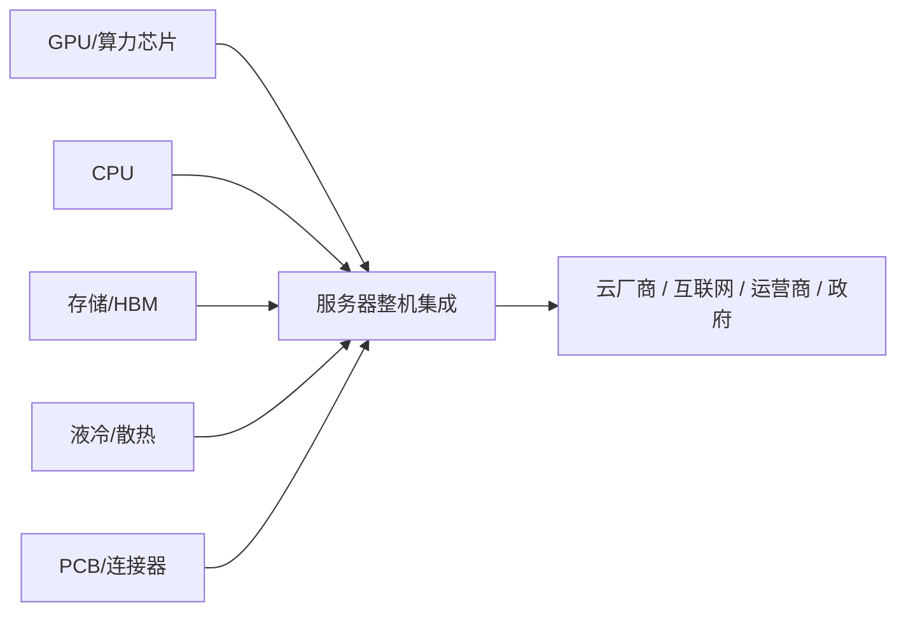

# 🖥️ 服务器 / 整机——AI 算力的"总装厂"

> **写给小白看的服务器/整机科普**，看完你就能理解：
>
> - AI 服务器到底是什么，为什么和普通服务器不一样
>
> - 浪潮信息为什么能接到字节 2000 亿的大单
>
> - 工业富联的利润为什么能翻倍
>
> - 全球 AI 服务器格局：SuperMicro 为什么能挑战 DELL、HP
>
> - 2026 为什么被称为"国产超节点元年"

---

## 一、一句话说清 AI 服务器是什么

**AI 服务器 = 把 GPU、CPU、内存、存储、散热、网络设备装成一整台能用来训练/推理 AI 的机器。**

用汽车来类比：

```
汽车制造：  发动机 → 变速箱 → 底盘 → 车身 → 总装 → 整车出厂
                    ↑ 都是"总装厂"的活
AI 服务器： GPU → CPU → HBM → 散热 → 集成 → 整机交付
                    ↑ AI 服务器的总装厂
```

### 谁造什么？

| 角色 | 对应汽车产业链 | 代表公司 |
|:-----|:---------------|:---------|
| **GPU/CPU**（核心零件） | 🔧 发动机制造商 | 英伟达（NVDA）、AMD（AMD）、Intel（INTC）、华为昇腾（-） |
| **HBM/存储**（内存/硬盘） | 🛞 轮胎/电池供应商 | SK 海力士（000660）、三星（005930）、美光（MU） |
| **散热/PCB**（配套零件） | 🔩 零配件厂 | 英维克（002837，液冷）、沪电股份（002463，PCB）|
| **整机集成**（服务器厂） | 🚗 **总装厂** ⭐ | **浪潮信息（000977）、工业富联（601138）、中科曙光（603019）** |
| **客户**（用的人） | 🚘 车主 | 字节跳动、腾讯、阿里、运营商 |

### 产业链位置

服务器位于 **第三层（基础设施配套）**，是算力芯片 → 算力服务的"最后一公里"：



---

## 二、AI 服务器 vs 普通服务器——天壤之别

AI 服务器和普通服务器的关系，就像**赛车 vs 家用轿车**——外形看着差不多，里面完全不是一回事。

| 维度 | 普通服务器 | AI 训练服务器 | 差距 |
|:-----|:-----------|:--------------|:-----|
| **GPU 数量** | 0-1 张（仅用于图形输出）| **8 张（标配）~ 640 张（超节点）** | ∞ 倍 |
| **价格** | $5,000 - $20,000 | **$200,000 - $2,000,000+** | 10-100 倍 |
| **功耗** | 0.5 - 2 kW | **10 - 100 kW+**（一台顶一栋楼）| 20-50 倍 |
| **散热** | 风冷（风扇） | **液冷必备**（74% 已采用液冷）| — |
| **内存** | 64 - 512 GB DDR5 | **1-2 TB（HBM + DDR5）** | 4-32 倍 |
| **存储** | 2-4 块 SSD | **30-70 TB 企业级 SSD** | 10-20 倍 |
| **网络** | 1-10 Gbps | **400-800 Gbps（InfiniBand/RoCE）** | 40-800 倍 |
| **重量** | 10-30 公斤 | **100-300 公斤** | 5-10 倍 |

来源：TrendForce、各厂商技术规格

> **一台 $200 万的 AI 服务器里，GPU（英伟达 H100/B200）和 HBM 占了 70-80% 的成本。** 服务器整机厂赚的是"组装费"和"供应链管理费"——毛利率通常只有 6-15%。

---

## 三、这个市场有多大？

### 市场规模速览

| 数据 | 数值 | 来源 |
|:----|:-----|:-----|
| **2025 年全球 AI 服务器出货量** | **~230 万台** | TrendForce |
| **2026 年全球 AI 服务器市场** | **~$1,900-2,400 亿** | Gartner / IDC |
| **2024→2029 年 CAGR** | **~22-28%** | MarketsandMarkets |
| **中国 AI 服务器市场（2026E）** | **~RMB 4,000 亿** | IDC / 赛迪顾问 |
| **AI 服务器占服务器总出货比重** | **~30%（2026），2028 年预计超 50%** | IDC |
| **平均每台 AI 服务器价格** | **$120,000 - $200,000**（含 GPU）| TrendForce |

来源：TrendForce、Gartner、IDC、MarketsandMarkets

> 📌 **关键认知：AI 服务器市场正在从"爆发期"进入"规模放量期"。** 2023-2025 年是"抢 GPU"阶段，2026 年开始进入"整机批量交付"阶段——整机集成商的议价能力和利润率有望提升。

### 为什么 2026 年是拐点？

三个力量同时作用：

1. **英伟达 Rubin 平台切换**：GB300 → Rubin，机架级架构需要更高的整机集成能力
2. **字节等大厂 2000 亿级资本开支**：中国云厂商/互联网公司的 AI 投资创历史新高
3. **国产算力加速**：华为昇腾 910C/920 大批量供货，国产超节点方案集中推出

---

## 四、核心公司详细展开

### 🥇 浪潮信息——AI 服务器国内第一

| 维度 | 内容 |
|:-----|:------|
| **定位** | AI 服务器国内市占率第一，被忽视的"AI 基建总承包" |
| **字节跳动份额** | **字节第一大 AI 服务器供应商，份额 >70%** |
| **订单能见度** | **订单排到 2027 年**，2026 年字节 2000 亿资本开支中的最大受益者 |
| **核心优势** | JDM（联合开发制造）模式，深度绑定字节跳动等大客户，从前期设计到量产全流程参与 |
| **2026 年看点** | 国产超节点放量 + 字节订单交付高峰年 |

> **为什么浪潮能拿到字节 70%+ 的份额？**
>
> 字节的 AI 基础设施策略是"深度定制"——不是买标准的服务器，而是让服务器厂按字节的架构需求来定制。浪潮的 JDM 模式恰好最匹配这种需求。
>
> 字节每年上百万台级别的采购量，对供应链的响应速度、交付能力、成本控制要求极高——浪潮是国内唯一能满足这种体量的服务器厂商。

**⚠️ 注意：** 浪潮信息被美国列入"实体清单"，无法采购最先进的英伟达 GPU（H100/B200 受限），目前主要供应面向中国市场的 AI 服务器（使用 H800/昇腾等替代方案）。这是**短期风险，但也是国产替代的长期催化剂**。

---

### 🥈 工业富联（Foxconn Industrial Internet）—— 全球 AI 服务器代工之王

| 维度 | 内容 |
|:-----|:------|
| **定位** | 全球最大的 AI 服务器代工厂，**全球 AI 服务器代工份额 >40%** |
| **2026 Q1 业绩** | **净利润 +102% YoY**，利润翻倍，整机集成环节利润释放的典型代表 |
| **核心客户** | 英伟达 DGX/HGX 服务器代工、AWS、Google、Microsoft |
| **核心优势** | 全球最大电子代工厂（富士康集团）的供应链管理能力、规模效应、液冷技术积累 |

> **工业富联的利润为什么能翻倍？**
>
> 过去两年 AI 服务器的"利润"主要在上游——英伟达（GPU）和 SK 海力士（HBM）吃肉，整机代工厂只能喝汤。但到 2026 年，随着：
> - **规模放量**：年出货量从几十万台 → 上百万台
> - **技术升级**：液冷整机柜方案的价值量提升（单台 $30-50 万→$100 万+）
> - **客户绑定加深**：从"按单组装"到"联合设计"
>
> 整机集成环节的毛利率从 6-8% 开始爬升到 10-15%，叠加出货量暴增，利润自然翻倍。

---

### 🥉 中科曙光——国产算力整机标杆

| 维度 | 内容 |
|:-----|:------|
| **定位** | 国产算力整机标杆，**背靠中科院计算所，信创/国产替代首选标的** |
| **核心亮点** | **全球首个 640 卡超节点**（2026 年推出），国产 AI 服务器算力密度新标杆 |
| **客户画像** | 三大运营商、政府/国企、科研机构为主 |
| **核心优势** | 国产化程度最高（CPU 用海光/飞腾，GPU 用昇腾/寒武纪），信创护城河深 |
| **对比浪潮** | 浪潮偏互联网大厂（字节/腾讯），曙光偏党政军/运营商 |

> **中科曙光的"超节点"是什么？**
>
> 传统的 AI 服务器是 8 卡一台（8 张 GPU），多台机器通过网络互联。但中科曙光的 640 卡超节点是把 **640 张 GPU 通过超高速互联做成一台"超级机器"**——相当于 80 台传统 AI 服务器拼在一起，但互联带宽是传统网络的 10 倍以上。
>
> 这对大规模 AI 训练极有价值：模型参数分布在 640 张 GPU 上，通信开销大幅降低，训练效率显著提升。

---

### 华勤技术——超节点新玩家

| 维度 | 内容 |
|:-----|:------|
| **定位** | 从手机 ODM 跨界到 AI 服务器的"黑马" |
| **核心能力** | **少数同时具备 GPU/CPU/交换节点设计能力的厂商** |
| **产品线** | AI 训练服务器 + AI 推理服务器 + 超节点交换方案 |
| **当前状态** | 2025-2026 年快速切入 AI 服务器领域，已进入部分互联网厂商供应链 |
| **一句话评价** | 起点低但能力全面，超节点趋势下的弹性标的 |

---

### 📊 四家对比一览

| 维度 | 浪潮信息 🥇 | 工业富联 🥈 | 中科曙光 🥉 | 华勤技术 |
|:-----|:-----------|:-----------|:-----------|:---------|
| **市场** | **国内第一**（AI 服务器）| **全球第一**（代工）| 国产算力标杆 | 新玩家 |
| **2026 Q1 利润增速** | ~50%+（估算）| **+102%** ✅ | ~30-40%（估算）| 起步阶段 |
| **核心客户** | 字节跳动（~70%）| 英伟达、AWS、MS | 运营商、政府 | 互联网厂商 |
| **GPU 可及性** | ⚠️ 受美国制裁限制 | ✅ 全球采购无限制 | ✅ 国产 GPU 为主 | ✅ 灵活采购 |
| **超节点能力** | ✅ 有方案 | ⚠️ 代工为主 | ✅ **640 卡超节点** | ✅ GPU/CPU/交换 |
| **估值逻辑** | 业绩爆发 + 国产替代 | 全球 AI 代工龙头 | 信创 + 算力基建 | 弹性成长标的 |

---

## 五、全球格局：SuperMicro、DELL、HPE 的 AI 服务器之战

AI 服务器不只有中国公司在做，全球市场有三个不得不提的巨头。

### 全球 AI 服务器厂商格局（2026E）

| 公司 | 总部 | 全球 AI 服务器份额 | 核心特征 |
|:-----|:-----|:-----------------|:---------|
| **SuperMicro（SMCI）** 🥇 | 🇺🇸 美国 | **~17-20%** | AI 服务器"纯正标的"，GPU 服务器占比最高 |
| **Dell Technologies（DELL）** 🥈 | 🇺🇸 美国 | **~15-18%** | 全球最大服务器厂商之一，传统业务底盘大 |
| **HPE（HPE）** 🥉 | 🇺🇸 美国 | **~10-12%** | 企业级 AI 方案为主，收购 Cray 强化超算 |
| **浪潮信息（000977）** | 🇨🇳 中国 | **~8-10%（全球）/ ~35%+（中国）** | 中国 AI 服务器绝对龙头 |
| **工业富联（601138）** | 🇨🇳 中国 | **代工 >40% 全球** | 全球最大 AI 服务器代工厂 |
| **联想（0992.HK）** | 🇨🇳 中国 | ~5-8% 全球 | 企业级服务器为主 |

来源：IDC、TrendForce（2026 Q1 数据口径）

### 逐个看

#### 🇺🇸 SuperMicro——AI 服务器的"纯血标的"

- **为什么重要？** SuperMicro 是全球 AI 服务器里**最纯粹的选择**——不像 DELL 和 HPE 还有大量传统业务，SuperMicro 的营收超过 60% 来自 AI/GPU 服务器
- **2026 年特点**：在英伟达 Rubin 平台切换中，SuperMicro 的液冷整机柜方案是核心卖点
- **风险**：高估值 + 高度依赖英伟达生态

#### 🇺🇸 Dell Technologies——规模最大

- 全球服务器出货量第一（包括非 AI 服务器），AI 服务器在其整体营收中占比在 2025-2026 年快速爬升
- 优势是企业级客户覆盖最广；劣势是利润率偏低（毛利率 ~10-12%）

#### 🇺🇸 HPE——超级计算基因

- 2019 年收购 Cray 超级计算业务后，在高性能计算/AI 训练领域有技术积累
- AI 服务器主要面向**企业级 AI（而非超大互联网厂商）**
- HPE 和 SuperMicro 都在为争夺"戴尔之后的第三极"而竞争

---

## 六、2026 是"国产超节点元年"

### 什么是超节点？

```
传统 AI 集群                        AI 超节点
┌──────────┐  ┌──────────┐        ┌─────────────────────┐
│ 8 GPU 机 │→→│ 8 GPU 机 │→→      │    640 张 GPU       │
│  服务器   │  │  服务器   │        │    在统一架构内      │
└──────────┘  └──────────┘        │   超高速互联        │
    ↑ 网络互联                    │   训练效率提升 2-3x  │
    瓶颈明显                      └─────────────────────┘
```

**为什么 2026 年是元年？**

1. **华为昇腾 910C 大规模供货**：国产 GPU 得到批量供应，不再受制于英伟达
2. **中科曙光推出 640 卡超节点**：全球首个国产 640 卡方案
3. **浪潮、华勤同步跟进**：各自的超节点方案在 2026 年集中发布
4. **字节等中国大厂大力支持**：国产超节点在字节等互联网公司大规模部署

| 公司 | 超节点方案 | 算力规模 | 客户 |
|:-----|:----------|:---------|:-----|
| 中科曙光 | 640 卡超节点 | 640× 昇腾 910C | 运营商、政府 |
| 浪潮信息 | 集群级超节点方案 | 多机紧耦合 | 字节跳动 |
| 华勤技术 | GPU/CPU 交换方案 | 模块化超节点 | 互联网厂商 |

---

## 七、字节 2000 亿资本开支——产业链最大的变量

### 发生了什么？

2026 年，字节跳动（ByteDance）将其 AI 资本开支**上调至 ~2000 亿人民币**（约 $280 亿美元），主要用于：

- 采购 AI 服务器（GPU + 整机）
- 建设数据中心（包括液冷基础设施）
- 网络设备（光模块 / 交换机）

### 谁受益最大？

| 环节 | 受益程度 | 代表公司 |
|:-----|:---------|:---------|
| **服务器整机** | ⭐⭐⭐ **最大受益者** | **浪潮信息**（份额 >70%）|
| **GPU 采购** | ⭐⭐⭐ 直接受益 | 英伟达（H800）/ 华为昇腾 |
| **数据中心** | ⭐⭐ 间接受益 | 润泽科技（字节 IDC 供应商）|
| **光模块** | ⭐⭐ 间接受益 | 中际旭创、新易盛 |
| **液冷** | ⭐⭐ 间接受益 | 英维克、高澜股份 |

### 利润流动的逻辑

```
2024 年：                    2026 年：
英伟达吃 90% 利润            GPU 成本趋于稳定
SK 海力士吃 5%               AI 服务器出货量 10x+
整机厂吃 5% (6-8% 毛利率)    整机厂吃 10-15% (毛利率爬升)
                            → 整机集成环节开始释放利润
```

> **关键判断：** AI 服务器整机集成正在从"搬运工"变成"技术集成商"。毛利率从 6-8% 爬升到 10-15%，叠加出货量暴增，利润弹性远大于上游。

---

## 八、风险也要知道

| 风险 | 怎么说 |
|:-----|:-------|
| **GPU 供应受限** | 美国制裁升级 → 中国 AI 服务器厂拿不到高端 GPU → 产品竞争力下降 |
| **英伟达一家独大** | 整机厂的利润天花板被 GPU 成本压住，毛利率难大幅突破 |
| **竞争加剧** | 联想、华勤等新玩家涌入 → 价格战 → 利润被压缩 |
| **客户集中度过高** | 浪潮极大依赖字节（>70% 份额），一旦字节切换供应商会受重大冲击 |
| **估值透支** | 工业富联 2026 年已涨 102%，浪潮涨幅较大，部分预期已经 Price In |
| **国产替代不及预期** | 华为昇腾的产能和性能是否真能大规模替代英伟达，仍有不确定性 |
| **AI 资本开支放缓风险** | 如果 AI 商业化回报不如预期，大厂可能削减 2027-2028 年资本开支 |

---

## 九、一句话总结

> **AI 服务器是 AI 算力的"总装厂"——不造 GPU 但决定 GPU 能不能用好。**
>
> **浪潮（字节线）、工业富联（全球代工线）是最确定的；中科曙光（国产线）是国产替代核心标的。**
>
> **2026 年的核心逻辑是：整机集成环节从"搬运工"变成"技术集成商"，毛利率爬升 + 出货量暴增 = 利润翻倍。** 字节 2000 亿资本开支是催化剂，国产超节点是新变量。

---

### 关键趋势速览

| 趋势 | 影响 |
|:-----|:------|
| 🟢 **2026 是国产超节点元年** | 浪潮、中科曙光、华勤都在推国产 AI 服务器 |
| 🟢 **利润向中游整机流动** | 工业富联 Q1 利润翻倍，整机集成开始释放利润 |
| 🟢 **字节 2000 亿资本开支** | 浪潮信息是最大受益者 |
| 🟢 **液冷成为标配** | 74% 的 AI 训练服务器已采用液冷 |
| 🟡 **美国制裁风险** | 实体清单限制中国服务器厂获取高端 GPU |
| 🟡 **竞争加剧** | 新玩家涌入，潜在价格战风险 |

---

> *免责声明：以上分析仅供参考，不构成投资建议。股市有风险，投资需谨慎。*

*数据来源：TrendForce、Gartner、IDC、MarketsandMarkets、各公司 2026 Q1 财报、公开新闻*

*最后更新：2026-05-26 15:39（北京时间）*
