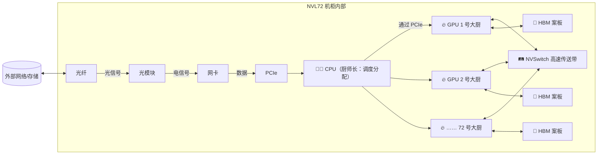

# 🧩 NVL72 深度拆解——一台 AI 超节点里有什么？

> **写给小白看的 NVL72 拆解**，看完你就能理解：
>
> - NVL72 到底是什么，为什么它不只是一台"大服务器"
>
> - GPU、CPU、HBM、NVSwitch、光模块……这些东西各管什么
>
> - 为什么 NVL72 能把 72 块 GPU 变得像 1 块超级 GPU 一样工作
>
> - 英伟达为什么说这是"AI 工厂"的基本单元

---

## 一、NVL72 是什么——一句话

**NVL72 = 英伟达把 72 块顶级 GPU + 一堆配套硬件，打包成一台机柜那么大的超级计算机。**

> 💡 类比：普通服务器像一辆小轿车，NVL72 像一列高铁——同样是在跑，但里面的架构、动力、价格都完全不是一个级别。

| 对比 | 普通 AI 服务器（8 卡） | NVL72 |
|:----|:---------------------|:------|
| GPU 数量 | 8 张 H100/B200 | **72 张 H100/B200** |
| 价格 | ~$20-30 万 | **~$300 万美元**（2000 多万人民币）|
| 功耗 | ~10 kW | **~120 kW**（够一栋 100 户小区的照明）|
| 互联方式 | PCIe（通道窄） | **NVLink + NVSwitch（通道极宽）** |
| 重量 | ~100 公斤 | **~1,500 公斤**（一台小汽车）|
| 定位 | 单台服务器 | **超节点 = 一台超级计算机** |

---

## 二、拆开看看——里面到底有什么

NVL72 机柜里装的不是一个电脑，是一整套**精密流水线**。我们用**一家顶级餐厅的后厨**来理解👇

| 组件 | 在软件中的角色 | 🤵 **餐厅比喻** | 数量（NVL72） |
|:----|:--------------|:---------------|:-------------|
| **GPU** | 真正干活的"算力主力" | 🔥 大厨（切菜炒菜全包） | 72 块 |
| **CPU** | 分配任务、引导数据流 | 👨‍🍳 厨师长（分单催单） | 几十颗 |
| **HBM** | GPU 旁边的超高速缓存 | 🥩 大厨手边的案板（不用跑腿拿材料）| ~5.7 TB |
| **PCIe** | 机柜内部的标准通道 | 🚶 餐厅走廊（大路，走得慢） | — |
| **NVLink** | GPU 之间的超高速通道 | 🏎️ 大厨间的专用传菜滑梯 | — |
| **NVSwitch** | 72 块 GPU 全互联的核心 | 🛤️ 传送带枢纽（A 大厨→B 大厨一秒到）| 多颗 |
| **NIC 网卡** | 对外收发数据的窗口 | 📦 外卖窗口 | 多张 400G/800G |
| **光模块** | 电信号↔光信号翻译器 | 🎁 外卖打包盒（把菜打包成能远送的形态）| ~144 个 |
| **光纤** | 传输光信号的线路 | 🛣️ 外卖高速路 | 几百根 |
| **交换机** | 机柜与外界的中转站 | 🚦 外面的快递中转中心 | 连接着用 |

---

## 三、逐个深入——各自干什么

### 🔥 GPU（图形处理器）——**大厨本厨**

GPU 是 NVL72 存在的**唯一理由**。每一块 H100/B200 有上千个核心，能同时做几百万个数学运算。

- 训练 AI：模型里全是"矩阵乘法"（一排数字 × 另一排数字），GPU 最擅长的就是这个
- NVL72 有 72 块，每块能独立干活，也能合起来干一个大活

### 👨‍🍳 CPU（中央处理器）——**厨师长**

GPU 不会自己找活干。CPU 负责：

- 从硬盘/网络把训练数据读进来
- 分好任务："你这块 GPU 算前 1/72，那块算后 1/72"
- GPU 算完了，CPU 把结果收回来写回存储

> CPU 擅长"一个接一个"的逻辑判断（if/else），GPU 擅长"一万人同时算"的大规模并行——两者是互补的。

### 🥩 HBM（高带宽内存）——**大厨手边的案板**

HBM 是贴在 GPU 旁边的超高速内存。训练 AI 时，模型参数要反复读写——如果去机柜另一边拿数据，速度会慢几十倍。

> 💡 对比记忆：
> - 你的电脑内存（DDR5） = **厨房远处冰箱**（走过去要时间）
> - HBM = **大厨手边的案板**（随手就拿）

NVL72 总 HBM 容量：`72 × 80GB（H100）≈ 5.7TB`，全部紧贴 GPU 放置。

### 🚶 PCIe（外围组件互联标准）——**餐厅走廊**

PCIe 是机柜内部最通用的**标准通道**，连接 CPU、GPU、网卡、存储等组件。

但 NVLink 比 PCIe 快很多，所以 NVL72 里：

| 通道 | 速度（双向） | 用来干什么 |
|:----|:------------|:----------|
| **PCIe 5.0** | ~128 GB/s | CPU ↔ GPU、网卡 ↔ CPU 等常规连接 |
| **NVLink 5.0** | **~900 GB/s** | GPU ↔ GPU（7 倍于 PCIe！） |

> 用快递对比：PCIe 是普通快递（3-5 天到），NVLink 是顺丰特快（次日达还带冷链）。

### 🏎️ NVLink + 🛤️ NVSwitch——**大厨之间的高速传送带**

这是 NVL72 最核心的**独门武器**。

- **NVLink**：GPU 之间的超高速连接通道
- **NVSwitch**：一个巨大的交换机芯片，让**任意两块 GPU 都能直连**

普通服务器里 8 块 GPU 走 PCIe 通信，速度和带宽都有限。NVL72 里 **72 块 GPU 通过 NVSwitch 全部互联**，每块 GPU 都能以近 **900 GB/s** 的速度跟其他任意一块 GPU 对话。

> 💡 **这就好比 72 个大厨每人面前都有 71 条传送带直通其他大厨的案板——想传菜？0.1 秒到达。**

#### 为什么 NVSwitch 如此重要？

训练大模型（比如 GPT-4 级别）时，模型参数太大，一块 GPU 装不下，必须**切分成 72 份**放在 72 块 GPU 上。训练过程中，它们要不停地互相传递中间计算结果。

**没有 NVSwitch**：传一次要绕路走 CPU → PCIe → CPU，速度极慢，72 块 GPU 的效率可能还不如 4 块。

**有 NVSwitch**：传一次直通直达，72 块 GPU 感觉像**1 块超级 GPU**一样工作。这就是英伟达敢说"NVL72 是一台 AI 超级计算机"的底气。

### 📦 NIC 网卡 + 🎁 光模块 + 🛣️ 光纤——**外卖窗口到送餐高速**

这三样是机柜**对外的嘴巴和耳朵**：

1. **NIC 网卡**（CX7/CX8 ConnectX）：插在机柜上的物理接口，把数据变成电信号发出去/收进来
2. **光模块**：插在网卡上，把**电信号翻译成光信号**（铜线跑几米信号就没了，光信号能跑几公里不丢）
3. **光纤**：光走的通道，从机柜连到外面的交换机

> **一条完整链路：** 网卡（电）→ 光模块（电→光翻译）→ 光纤（光传输）→ 对面光模块（光→电翻译）→ 对面设备

### 🚦 交换机——**外面的快递中转站**

NVL72 不是孤岛。它需要和其他机柜、存储系统、网络通信，这时候就需要交换机（ToR / Leaf / Spine）来做**路由和转发**。

> 比喻：NVL72 是一家餐厅的后厨，交换机就是外面的快递公司——告诉你"这单送去 A 机柜，那单送去存储服务器"。

---

## 四、一张图看懂全部协作

**数据流动顺序：**

> **外部进来** → 光纤 → 光模块 → 网卡 → PCIe → **CPU（分任务）** → PCIe → **GPU 开始算**（在 HBM 上读写 + 通过 NVSwitch 互相传中间结果）→ 算出结果 → 原路返回

> 💡 **关键认知：NVSwitch 让 NVL72 的 72 块 GPU 对外看起来像一台超级 GPU。** 这是英伟达最值钱的技术壁垒，AMD、英特尔短期内都追不上。

---

## 五、NVL72 在投资视角下的意义

| 投资维度 | 解读 |
|:---------|:-----|
| 🏗️ **整机集成** | NVL72 是"机架级"产品，英伟达从卖芯片变成卖整机，**每个机柜 ~$300 万，毛利极高** |
| 🧱 **护城河** | NVSwitch + NVLink 是英伟达独有，**竞争对手造不出同级产品**，云厂商只能买 |
| 🔩 **受益产业链** | 光模块（中际旭创/天孚通信）、PCB（沪电股份）、液冷（英维克）、服务器（工业富联/浪潮）**每个 NVL72 机柜带动的零部件价值量极高** |
| ⚖️ **风险** | 单机柜 ~120kW 功耗，**散热和电力是瓶颈**；美国政府出口管制影响中国客户采购 |

---

> **最后更新：2026-05-25 21:00（北京时间）**
