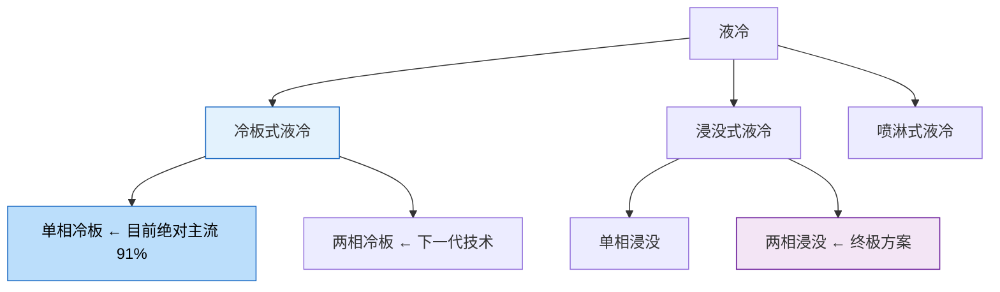
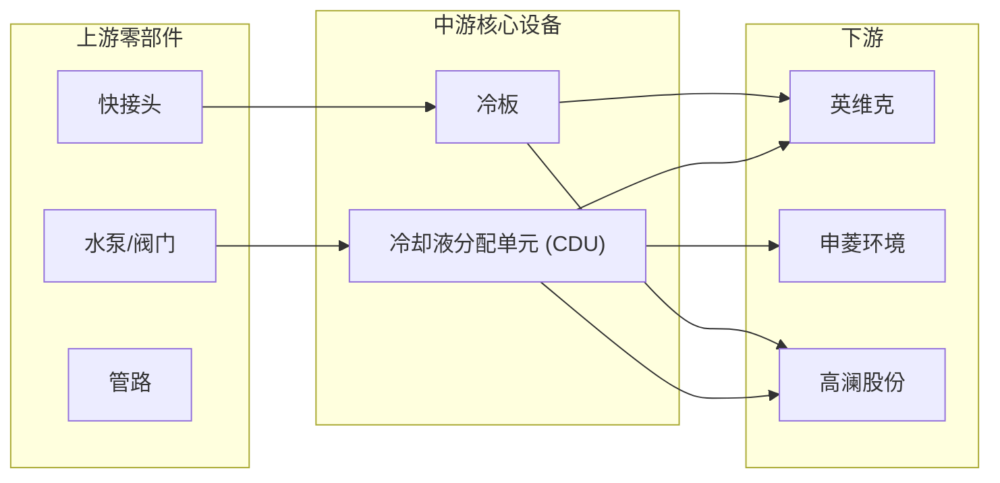

# 🌡️ 液冷入门——AI 数据中心的"空调"为什么突然重要了？

> **写给小白看的液冷行业科普**，看完你就能理解：
> - 为什么 GPU 越来越热，风冷搞不定了
> - 液冷有哪些流派，各有什么优缺点
> - 这个市场有多大，谁是龙头
> - 投资液冷的核心逻辑在哪里

---

## 一、一句话说清楚液冷是干什么的

**液冷 = 给 AI 芯片"洗澡降温"。**

就像你的电脑打游戏时会发热、需要风扇散热一样——AI 数据中心的 GPU 比你的电脑热 **几百倍**，风扇吹不动了，需要用液体来降温。

> 💡 **一个类比**：风冷就像用电风扇吹一碗热汤，液冷就像把汤碗泡在冷水池里。哪个降温快？显然泡水里快。

---

## 二、为什么原来好好的风冷突然不行了？

### 因为 GPU 的功耗在"狂飙"

看看英伟达这几代 GPU 的功耗变化：

```
A100（2020）→ 400W    ≈ 一台游戏笔记本
H100（2022）→ 700W    ≈ 一台微波炉
B200（2024）→ 1200W   ≈ 一台空调
Rubin（2026）→ 2000W+ ≈ 一台电磁炉
```

**一个机柜** 塞满 GPU 后，功耗从以前的 **8kW** 飙到了 **100kW 以上**。

### 风冷的物理极限

- 空气的导热能力有限，**功率超过 ~800W/芯片** 风冷就压不住了
- 现在的 GPU 已经是 1200W→2000W+，**风冷彻底不够用**
- 好比用电风扇去吹一个正在烧红的铁块——风再大也没用

**所以液冷不是"选择"，是"必须"。**

---

## 三、液冷分哪几种？（只看这一张表就够了）

液冷有好几种技术路线，但 90% 的市场份额集中在 **冷板式液冷**：



### 三种路线一张表看懂

| 技术路线 | 怎么工作的 | 举个🌰 | PUE | 市占率 | 一句话判断 |
|:---------|:----------|:-------|:---|:------|:----------|
| **冷板式** | 一块"水冷板"贴在芯片上，水在里面流过带走热量 | 就像贴在发烧额头上的退热贴 | 1.2-1.4 | **~91%** | ✅ **当前主流，最成熟** |
| **浸没式** | 整台服务器泡进特殊的液体里 | 就像把电子产品泡进变压器油里 | 1.03-1.13 | ~8% | 🌱 未来方向，但成本高、维护难 |
| **喷淋式** | 像花洒一样把冷却液喷到芯片上 | 就像给芯片"淋浴" | 1.1-1.2 | ~1% | 🧪 小众路线 |

> **PUE** 是数据中心能效指标，PUE = 总能耗 ÷ 芯片能耗。越接近 1.0 越好。
> 风冷的 PUE 一般在 1.4-1.6，液冷能做到 1.2 以下。**PUE 从 1.5 降到 1.2，电费直接省 20%。**

---

## 四、这个市场有多大？

### 几个关键数字

| 数字 | 含义 |
|:-----|:------|
| **2026 年全球液冷市场** | **~$170 亿美元**（摩根大通预测）|
| **2026 年中国液冷市场** | **~700-800 亿元** |
| **2025 年液冷渗透率** | **~12%**（2024 年才 5%） |
| **2026 Q1 渗透率** | **28%**（半年翻了一倍多）|
| **AI 训练服务器液冷渗透率** | **已经 74%** |
| **工信部新规** | 新建数据中心液冷渗透率 ≥ **60%** |

**趋势很明显：液冷渗透率正在从"早期采用"进入"大规模普及"阶段。** 机构预测 2027 年 AI 服务器的液冷渗透率将达到 **80%**。

### 为什么 2026 年是拐点？

三个力量同时作用：
1. **芯片功耗**：英伟达 Rubin 平台 2000W+，不用液冷不行
2. **政策**：工信部强制要求新建数据中心 ≥60% 用液冷，北京上海直接**禁止新建风冷数据中心**
3. **成本**：液冷的成本在下降，已经跟风冷差距不大（TCO 角度看甚至更优）

---

## 五、A 股液冷三强对比

液冷产业链很长（从冷板→管路→泵→阀门→CDU→整机方案），但 A 股最核心的是这三家：



### 🥇 英维克——龙头，也是 A 股最纯的液冷标的

| 维度 | 数字 |
|:-----|:------|
| **营收规模** | ~46 亿（2024），2026 预计突破 92 亿 |
| **核心优势** | 全链条覆盖，从冷板到 CDU 到整机房方案都能做 |
| **最大看点** | **打入 Google/NVIDIA 供应链**——快接头已进英伟达 MGX 生态，Google 审厂通过 |
| **关键数据** | 累计交付 1.2GW 液冷项目，**零漏液记录** |
| **风险** | 2026 Q1 增收不增利（营收 +26%，利润 -82%），还在投入期 |

### 🥈 申菱环境——CDU 市占率第一

| 维度 | 数字 |
|:-----|:------|
| **营收规模** | ~30 亿（2024） |
| **核心优势** | **CDU 国内市占率第一**，华为/腾讯/字节都是客户 |
| **最大看点** | 华为昇腾液冷需求带来增量，CDU 冠军地位在 AI 建设潮中受益 |
| **风险** | 项目制交付导致季度波动大 |

### 🥉 高澜股份——弹性最大的"黑马"

| 维度 | 数字 |
|:-----|:------|
| **营收规模** | ~7 亿（2024），体量最小 |
| **核心优势** | **字节核心 CDU 供应商**，冷板+浸没双路线 |
| **最大看点** | 在手订单 14.56 亿（+159%），订单爆发力极强 |
| **毛利率** | 从 19.7% 逆袭到 27.8%（三强最高）|
| **风险** | 盈利基数小，确定性弱于英维克 |

### 三强一句话选谁

| 你的偏好 | 可能更适合 |
|:---------|:----------|
| **求稳，看好海外 AI 需求** | 英维克——Google/NVIDIA 供应链，确定性最高 |
| **看好国内算力建设** | 申菱环境——CDU 冠军，华为链 |
| **追求高弹性，能承受波动** | 高澜股份——订单暴增，但规模和确定性最弱 |

---

## 六、投资液冷的三大核心逻辑

### 逻辑一：渗透率从 12% → 80% 的"爬坡红利"

液冷现在处于 **12% 渗透率 → 80% 渗透率** 的高速增长期。在这个阶段：
- 行业增速不取决于"芯片有没有突破"
- 而取决于**还有多少数据中心没换液冷**
- 这是一个确定性的"替代过程"，不是"赌新技术"

> 类比：就像 2015-2020 年新能源汽车渗透率从 5% 提到 30% 的阶段，谁是龙头、谁是黑马不重要，**整个产业链都在涨**。

### 逻辑二：政策在"强制"推

- 工信部：2026 年新建数据中心液冷渗透率 ≥ **60%**
- 四部门：东数西算枢纽节点 **70% 须用液冷**
- 北京/上海：**禁止新建风冷数据中心**

这不是"要不要换"的问题，是"必须换"的问题。

### 逻辑三：英伟达 Rubin 平台是催化剂

Rubin 平台（2000W+ 单芯片）2026 年下半年量产，这意味着一波**替换升级周期**：
- 现在的 Blackwell 机柜 ~100kW
- Rubin 机柜 ~200kW+
- 老风冷机房直接报废，新建必须上液冷

---

## 七、风险也要知道

| 风险 | 怎么说 |
|:-----|:-------|
| **渗透率已经 74%（AI 训练端）** | 最肥美的"从 0 到 1"阶段可能已经过去了 |
| **龙头增收不增利** | 英维克 Q1 利润 -82%，说明行业还在"烧钱抢份额"阶段 |
| **技术路线切换** | 如果浸没式突然替代冷板式，现有冷板产能会贬值 |
| **竞争激烈** | 这是一个门槛不算极高的赛道，越来越多玩家涌进来 |
| **估值不便宜** | 三强股价都已经涨了不少，预期已经把未来几年的增长算进去了 |

---

## 八、一句话总结

> **液冷不是"要不要"的问题，是"什么时候换"的问题。**
>
> 2026 年是液冷的渗透率拐点——政策推、芯片热、成本降，三重力量同时作用。英维克是确定性最高的龙头，但股价不便宜了。**好赛道也需要好价格。**

---

> 🚧 **详细公司报告待撰写**，后续计划覆盖：英维克、高澜股份、申菱环境

> *免责声明：以上分析仅供参考，不构成投资建议。股市有风险，投资需谨慎。*
