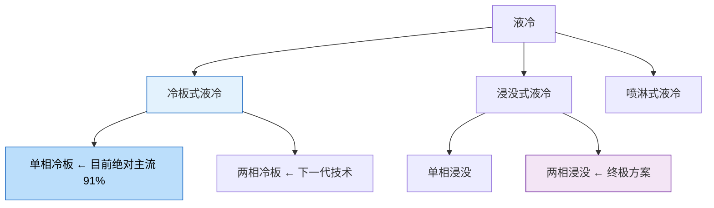

# 🌡️ 液冷入门——AI 数据中心的"空调"为什么突然重要了？

> **写给小白看的液冷行业科普**，看完你就能理解：
> - 为什么 GPU 越来越热，风冷搞不定了
> - 液冷有哪些流派，各有什么优缺点
> - 全球市场有多大，龙头都是谁
> - 中国玩家在全球格局中的位置

---

## 一、一句话说清楚液冷是干什么的

**液冷 = 给 AI 芯片"洗澡降温"。**

就像你的电脑打游戏时会发热、需要风扇散热一样——AI 数据中心的 GPU 比你的电脑热 **几百倍**，风扇吹不动了，需要用液体来降温。

> 💡 **一个类比**：风冷就像用电风扇吹一碗热汤，液冷就像把汤碗泡在冷水池里。哪个降温快？显然泡水里快。

---

## 二、为什么原来好好的风冷突然不行了？

### 因为 GPU 的功耗在"狂飙"

看看英伟达这几代 GPU 的功耗变化：

| GPU | 发布年份 | 功耗 | 类比 |
|:----|:---------|:-----|:-----|
| A100 | 2020 | 400W | ≈ 一台游戏笔记本 |
| H100 | 2022 | 700W | ≈ 一台微波炉 |
| B200 | 2024 | 1200W | ≈ 一台空调 |
| Rubin | 2026 | 2000W+ | ≈ 一台电磁炉 |

**一个机柜** 塞满 GPU 后，功耗从以前的 **8kW** 飙到了 **100kW 以上**。

### 风冷的物理极限

- 空气的导热能力有限，**功率超过 ~800W/芯片** 风冷就压不住了
- 现在的 GPU 已经是 1200W→2000W+，**风冷彻底不够用**
- 好比用电风扇去吹一个正在烧红的铁块——风再大也没用

**所以液冷不是"选择"，是"必须"。**

---

## 三、液冷分哪几种？（只看这一张表就够了）

液冷有好几种技术路线，但 90% 的市场份额集中在 **冷板式液冷**：

### 三种路线一张表看懂

| 技术路线 | 怎么工作的 | 举个🌰 | PUE | 市占率 | 一句话判断 |
|:---------|:----------|:-------|:---|:------|:----------|
| **冷板式** | 一块"水冷板"贴在芯片上，水在里面流过带走热量 | 就像贴在发烧额头上的退热贴 | 1.2-1.4 | **~91%** | ✅ **当前主流，最成熟** |
| **浸没式** | 整台服务器泡进特殊的液体里 | 就像把电子产品泡进变压器油里 | 1.03-1.13 | ~8% | 🌱 未来方向，但成本高、维护难 |
| **喷淋式** | 像花洒一样把冷却液喷到芯片上 | 就像给芯片"淋浴" | 1.1-1.2 | ~1% | 🧪 小众路线 |

> **PUE** 是数据中心能效指标，PUE = 总能耗 ÷ 芯片能耗。越接近 1.0 越好。
> 风冷的 PUE 一般在 1.4-1.6，液冷能做到 1.2 以下。**PUE 从 1.5 降到 1.2，电费直接省 20%。**

---

## 四、这个市场有多大？

### 关键数字

| 数据 | 数值 | 来源 |
|:----|:-----|:-----|
| **2025 年全球 AI 服务器液冷市场** | **~$89 亿** | 摩根大通（2026.03）|
| **2026 年全球 AI 服务器液冷市场** | **~$170 亿+** | 摩根大通（2026.03）|
| **2025 年全球数据中心液冷渗透率** | **~12%** | IDC |
| **2026 Q1 液冷渗透率** | **28%**（半年翻了一倍多）| IDC |
| **AI 训练服务器液冷渗透率** | **74%** | IDC |
| **中国市场规模（2026E）** | **700-800 亿元**（约占全球 30%）| 摩根大通 |

来源：[摩根大通数据中心会议纪要](https://caifuhao.eastmoney.com/news/20260327070253404578400)、[新浪财经转载](https://finance.sina.com.cn/stock/relnews/cn/2026-04-21/doc-inhfivp0263547.shtml)、[同花顺](https://news.10jqka.com.cn/20260509/c676569246.shtml)

**趋势很明显：液冷渗透率正在从"早期采用"进入"大规模普及"阶段。**

### 为什么 2026 年是拐点？

三个力量同时作用：
1. **芯片功耗**：英伟达 Rubin 平台 2000W+，不用液冷不行
2. **政策**：中国工信部要求新建数据中心 ≥60% 用液冷；欧盟能效指令趋严；美国 DOE 标准也在收紧
3. **成本**：液冷的成本在下降，TCO（总拥有成本）角度看已接近甚至优于风冷

---

## 五、全球液冷产业链与核心玩家

### 产业链简要

液冷产业链从上游到下游大致是：

**零部件（冷板、水泵、管路、冷却液）→ CDU 整机 → 全栈液冷方案**

目前全球液冷市场最值得关注的是这 **4+1** 家公司：

---

### 🥇 Vertiv（维谛技术）—— 全球热管理之王

| 维度 | 内容 |
|:-----|:------|
| **市值** | ~$400 亿+ |
| **业务** | 全球数据中心热管理和基础设施龙头 |
| **核心优势** | 全球布局最广，从冷板到 CDU 到整机房方案全覆盖 |
| **英伟达关联** | NVL72/NVL144 机柜**指定液冷合作伙伴之一** |
| **主要客户** | AWS、Microsoft、Google、Meta 等全球超大规模云厂商 |
| **一句话** | **液冷投资的首选标的，没有之一** |

---

### 🥈 Schneider Electric（施耐德电气）

| 维度 | 内容 |
|:-----|:------|
| **市值** | ~€1400 亿 |
| **业务** | 全球最大的数据中心基础设施提供商 |
| **核心优势** | 从配电 → 冷却 → 软件监控全链条覆盖 |
| **液冷布局** | 收购+自研，提供从冷板到浸没式的完整方案 |
| **一句话** | **体量最大、最稳，但液冷只是其业务的一部分** |

---

### 🥉 nVent

| 维度 | 内容 |
|:-----|:------|
| **市值** | ~$100 亿+ |
| **核心产品** | 冷板液冷方案 |
| **核心优势** | 北美数据中心渠道强，液冷业务增速 50%+ |
| **一句话** | **冷板技术最纯，北美市场的液冷弹性标的** |

---

### 🌟 CoolIT Systems（加拿大）

| 维度 | 内容 |
|:-----|:------|
| **定位** | DLC（直接芯片级液冷）**技术领跑者** |
| **背景** | 被沙特阿美（Aramco）旗下基金收购，资金实力雄厚 |
| **核心优势** | 冷板技术行业领先，深度嵌入 Dell、HPE 等服务器 OEM 供应链 |
| **一句话** | **液冷技术最强的公司，但不单独上市** |

---

### 🔶 英维克 —— 唯一在全球排得上号的中国玩家

| 维度 | 内容 |
|:-----|:------|
| **营收** | ~46 亿（2024） |
| **核心优势** | 全链条覆盖，从冷板到 CDU 到整机房方案 |
| **全球进展** | **打入 Google/NVIDIA 供应链**，快接头已进英伟达 MGX 生态 |
| **海外市场** | 东南亚、中东数据中心项目持续落地 |
| **关键数据** | 累计交付 1.2GW 液冷项目，**零漏液记录** |
| **风险** | 2026 Q1 增收不增利（营收 +26%，利润 -82%），仍在投入期 |
| **一句话** | **中国唯一有全球竞争力的液冷公司** |

---

## 六、这五家在全球产业链中的位置

| 公司 | 冷板 | CDU 整机 | 全栈方案 | 全球客户覆盖 | 上市 | 市值量级 |
|:-----|:----|:---------|:---------|:------------|:----|:--------|
| **Vertiv** | ✅ | ✅ | ✅ | ⭐⭐⭐⭐⭐ | NYSE: VRT | ~$400 亿+ |
| **Schneider** | ✅ | ✅ | ✅ | ⭐⭐⭐⭐⭐ | EPA: SU | ~€1400 亿 |
| **nVent** | ✅ | ⚡ 强项 | ❌ | ⭐⭐⭐⭐ | NYSE: NVT | ~$100 亿+ |
| **CoolIT** | ⚡ 最强 | ✅ | ❌ | ⭐⭐⭐⭐ | 未上市 | — |
| **英维克** | ✅ | ✅ | ✅ | ⭐⭐（起步中）| 002837 | ~300 亿 RMB |

### 市场份额大致格局

- **Vertiv** 在数据中心热管理整体位居全球 **#1**
- **Schneider** 凭借基础设施综合优势在 **液冷方案端** 占据第二极
- **nVent / CoolIT** 在 **冷板和 DLC 环节** 有技术优势
- **英维克** 在国内市场领先，全球份额仍较小但在快速突破

---

## 七、投资液冷的三大核心逻辑

### 逻辑一：渗透率从 12% → 80% 的"爬坡红利"

液冷现在处于 **12% 渗透率 → 80% 渗透率** 的高速增长期。在这个阶段，行业增速不取决于技术有没有突破，而取决于**还有多少数据中心没换液冷**——这是一个确定性的"替代过程"。

> 类比：就像 2015-2020 年新能源汽车渗透率从 5% 提到 30% 的阶段，**整个产业链都在涨**。

### 逻辑二：全球政策同步收紧

| 地区 | 政策 |
|:-----|:------|
| **中国** | 工信部要求新建数据中心 ≥ **60%** 用液冷；北京/上海**禁止新建风冷数据中心** |
| **欧盟** | 能效指令推动数据中心 PUE 持续下降 |
| **美国** | DOE 能效标准趋严；部分州限制数据中心电力消耗 |
| **全球** | 云厂商纷纷承诺 2030 碳中和，液冷是关键手段 |

### 逻辑三：英伟达 Rubin 平台是催化剂

Rubin 平台（2000W+ 单芯片）2026 年下半年量产，意味着：
- 现在的 Blackwell 机柜 ~100kW → Rubin 机柜 ~200kW+
- 老风冷机房直接报废，新建必须上液冷

---

## 八、如果要从这五家里选

| 你的偏好 | 最匹配 |
|:---------|:-------|
| **最纯正、最直接的液冷投资** | **Vertiv** — 全球液冷之王 |
| **最稳、体量最大的选择** | **Schneider** — 基础设施巨无霸 |
| **北美液冷弹性标的** | **nVent** — 冷板技术纯正，增速快 |
| **看好中国 + 想投世界** | **英维克** — 进入 Google/NVIDIA 的中国龙头 |
| **技术最强** | **CoolIT** — 但不上市，可作为行业风向标观察 |

---

## 九、风险也要知道

| 风险 | 怎么说 |
|:-----|:-------|
| **AI 训练端渗透率已 74%** | 最肥美的"从 0 到 1"阶段可能已经过去了 |
| **龙头增收不增利** | 英维克 Q1 利润 -82%，行业仍在"烧钱抢份额" |
| **技术路线切换** | 如果浸没式替代冷板式，现有冷板产能会贬值 |
| **竞争激烈** | 门槛不算极高，越来越多玩家涌进来 |
| **估值透支** | Vertiv、英维克股价已涨不少，预期部分 Price In |

---

## 十、一句话总结

> **液冷不是"要不要"的问题，是"什么时候换"的问题。**
>
> 2026 年是全球液冷的渗透率拐点——芯片热、政策推、成本降，三重力量同时作用。
>
> **全球液冷首推 Vertiv；想技术看 CoolIT；中国看英维克。**

---

> *免责声明：以上分析仅供参考，不构成投资建议。股市有风险，投资需谨慎。*

*数据来源：摩根大通（2026.03）、IDC、中国信通院、各公司年报*
