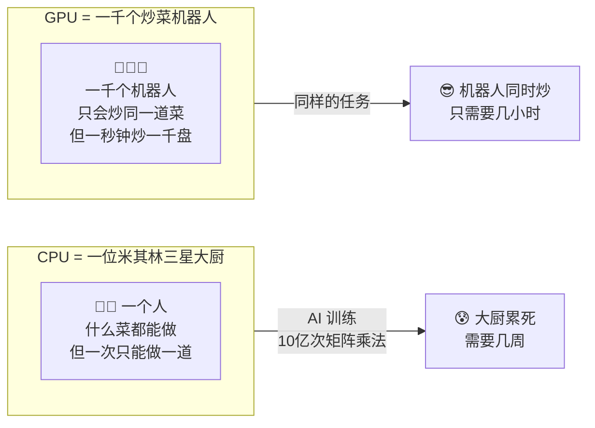
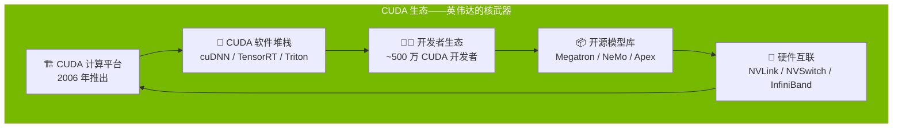

# 🔵 算力芯片——AI 的"大脑"

> **写给小白看的算力芯片科普**，看完你就能理解：
>
> - GPU 跟 CPU 到底有什么区别，为什么 AI 离不开 GPU
>
> - NVIDIA 为什么能占 ~80% 的市场，CUDA 是什么神秘武器
>
> - 英伟达 vs 定制芯片 vs 国产芯片，三个方向分别怎么看
>
> - 国产芯片性能落后，但靠"超节点"集群能不能弯道超车

---

## 一、一句话说清算力芯片是什么

**算力芯片，就是 AI 的"大脑"。**

整个 AI 产业链从下往上分为五层——底层是芯片，顶层是应用。算力芯片位于**最底层**，是所有 AI 应用的物理基础。没有芯片，就没有 AI。

```
AI 产业链五层结构

🎯 第五层：AI 应用 & 软件（OpenAI、Anthropic、DeepSeek）
    ↑
🔬 第四层：封测 & 制造（台积电 CoWoS、日月光）
    ↑
🌡️ 第三层：基础设施配套（液冷、服务器、数据中心）
    ↑
📡 第二层：硬件 & 元器件（光通信、存储芯片、PCB）
    ↑
🔵 第一层：算力芯片 ← 你在这里
    （GPU / 定制芯片 / 国产芯片）
```

> **核心认知**：每一层都建立在下一层之上。算力芯片不行，上面的一切都是空中楼阁。

---

## 二、GPU vs CPU：为什么 AI 需要 GPU 而不是 CPU

### 先弄清根本区别

大部分人对 GPU 的认知停留在"显卡打游戏"，但在 AI 时代，GPU 变成了"AI 计算的核心引擎"。

| 维度 | CPU（中央处理器） | GPU（图形处理器） |
|:-----|:-----------------|:-----------------|
| **设计哲学** | **串行计算**——一个强大的大脑处理复杂任务 | **并行计算**——成千上万个小脑同时处理简单任务 |
| **核心数量** | 8-64 个（高性能） | **数千个**（上万 CUDA Core） |
| **适合做什么** | 操作系统、逻辑判断、单线程任务 | 矩阵乘法、图像渲染、**AI 训练** |
| **AI 表现** | ❌ 慢到无法接受 | ✅ **快几千倍** |

### 用一个厨房来类比



**AI 训练的本质是什么？**

> 就是**大规模的矩阵乘法**——把几十亿个参数，跟几万亿个数据，反复做"矩阵 × 矩阵"的乘法，几十亿次。

这不是 CPU 擅长的"复杂多任务"，而是 GPU 擅长的"简单重复×大规模并行"。

### 那为什么还要 CPU？

AI 服务器不是"只要 GPU 不要 CPU"：

- **CPU**：负责调度、加载数据、跑操作系统、控制整个流程
- **GPU**：只负责"算"——矩阵乘法

```
一台 AI 训练服务器的典型架构：

GPU × 8（主力算力）
    ↑
CPU（调度+数据搬运）
    ↑
HBM（超高速内存，GPU 的"操作台"）
    ↑
SSD（海量训练数据存储）
```

---

## 三、三个方向详细介绍

AI 芯片不是只有英伟达一家能造。当前市场分为三条主线：

### 方向一：通用 GPU——英伟达的帝国

#### 英伟达：AI 芯片的绝对王者

| 维度 | 内容 |
|:-----|:------|
| **市值（2026.05）** | **~$3.5 万亿+** |
| **AI 芯片市占率** | **~80%**（数据中心 GPU） |
| **营收（TTM）** | **~$1500 亿**，增速 **+100%+** |
| **毛利率** | **~75%**——芯片界最高水平 |
| **核心产品** | H100 → Blackwell（B200）→ **Rubin（2026 H2）** |
| **客户** | 几乎所有云厂商（AWS、Azure、GCP）+ 各大 AI 公司 |

来源：各公司财报、行业估算

#### 英伟达的护城河——CUDA 生态

英伟达最大的护城河**不是硬件**，而是 **CUDA 生态**。



**为什么 CUDA 这么重要？**

- **2006 年推出**，比 AI 热潮早了将近 20 年
- 全世界有 **~500 万 CUDA 开发者**，所有主流 AI 框架（PyTorch、TensorFlow、JAX）都深度绑定 CUDA
- 不只是一个编程语言，而是**完整的软件栈**——从底层驱动到上层模型库，全被英伟达控制
- 换成 AMD 的 ROCm 或 Intel 的 oneAPI？**等于把所有代码重写一遍**，大部分公司根本不会这么做

> **一句话**：英伟达卖的不只是 GPU，而是"**GPU + CUDA + 网络 + 系统**"的完整解决方案。竞争对手能追上硬件，但追不上生态。

#### 英伟达的产品路线图

| 代际 | 发布时间 | 关键特性 |
|:-----|:---------|:---------|
| **H100（Hopper）** | 2022 | 当前最广泛部署的 AI 训练卡 |
| **B200（Blackwell）** | 2024 | 性能比 H100 提升 ~4 倍 |
| **Rubin（下一代）** | **2026 H2 量产** | Blackwell 的下一代，预期性能翻倍以上 |
| **Rubin 后续** | 2027+ | 采用更先进封装和互联技术 |

> **Rubin 平台（2026 H2）**是当前最重要的催化剂。每代产品迭代都带来性能翻倍，推动云厂商继续采购升级。

#### 追赶者 AMD

| 维度 | 内容 |
|:-----|:------|
| **GPU 产品** | MI300X / MI350 |
| **AI 市占率** | ~5-10%（追赶中） |
| **核心优势** | 性价比更高、开放的 ROCm 生态 |
| **最大挑战** | CUDA 生态太强，ROCm 兼容性和开发者数量差太多 |
| **大客户** | 微软（部分订单） |

**AMD 的困境**：硬件参数上，MI300X 跟 H100 拉不开差距。但软件生态上，CUDA 的领先是**十年以上**的积累。除非 AI 框架出现根本性的架构变革，否则 AMD 很难翻盘。

---

### 方向二：定制 AI 芯片（XPU / ASIC）

#### 什么是定制芯片？

大型云厂商发现：**通用 GPU 有些场景效率不够高**。

如果要**只干一件事**（比如只跑 Google Gemini、只跑 Meta Llama），那为啥不专门造一颗只干这件事的芯片？

这就诞生了**定制 AI 芯片（XPU / ASIC）**：

| 客户 | 芯片名称 | 代工伙伴 | 进展 |
|:-----|:---------|:---------|:-----|
| **Google** | TPU（v7 Ironwood） | **Broadcom** | 合作超 10 年，已到第 7 代 |
| **Meta** | MTIA | **Broadcom** | 协议到 2029 |
| **OpenAI** | 首款定制 XPU | **Broadcom** | 2026 年加入，预计 2027 出货 |
| **Anthropic** | — | **Broadcom** | 最新加入 |
| **Amazon** | Trainium / Inferentia | Marvell | AWS 自研 |

#### Broadcom——定制芯片之王

Broadcom 已经在前序文章中详细覆盖（→ [Broadcom 深度分析](../光通信/broadcom.md)），这里简要引用：

| 维度 | 内容 |
|:-----|:------|
| **AI 定制芯片定位** | 全球最大的 AI 定制芯片（XPU）设计公司 |
| **AI 收入增速** | **+106%**（FY2026 Q1），指引 +140% |
| **AI 市占率** | 全球 AI ASIC 市场 **~40-50%**（2026E） |
| **市场份额** | 全球唯二能做万卡级 AI 定制芯片的公司（另一家是 Marvell） |
| **订单保障** | **$730 亿** backlog 已锁定到 2028 |
| **核心客户** | Google（~78% 的 AI 芯片收入）、Meta、OpenAI、Anthropic |

来源：[Broadcom 深度分析](../光通信/broadcom.md)、公司财报

#### Marvell——第二把交椅

| 维度 | 内容 |
|:-----|:------|
| **市值** | **~$800 亿** |
| **营收（TTM）** | **~$70 亿** |
| **核心业务** | 定制 ASIC（Amazon Trainium）+ 网络芯片（交换 DSP） |
| **PS** | **~11x**（板块最低） |
| **最大客户** | Amazon（AWS 自研芯片） |

> **定制芯片 vs 通用 GPU 的分工**：通用 GPU（英伟达）做"所有 AI 任务"，定制芯片（Broadcom/Marvell）针对"特定客户的最佳化方案"。不是简单的竞争，而是**产业链分工**。

---

### 方向三：国产 AI 芯片

#### 现状格局

| 公司 | 产品 | 定位 | 2026 年状态 |
|:-----|:-----|:-----|:------------|
| **寒武纪** | 思元系列 | AI 训练 + 推理芯片 | 国产 AI 芯片龙头，产品迭代中 |
| **海光信息** | 深算系列（DCU） | 类 GPU 架构，兼容 CUDA | 走兼容路线，降低开发者迁移成本 |

#### 国产芯片的核心困境

> **一句话：单卡性能追不上英伟达。**

| 对比维度 | 英伟达 H100/B200 | 国产 AI 芯片（当前） |
|:---------|:-----------------|:-------------------|
| **单卡算力** | ⭐⭐⭐⭐⭐ | ⭐⭐⭐（差距 2-3 代） |
| **内存带宽（HBM）** | ⭐⭐⭐⭐⭐ | ⭐⭐⭐（HBM 供应受限） |
| **软件生态** | ⭐⭐⭐⭐⭐（CUDA） | ⭐⭐（迁移成本高） |
| **制程工艺** | 4nm（台积电） | 受制裁限制 |

#### 国产替代的核心逻辑——超节点（Scale-up）

既然单卡追不上，那就**靠更多卡堆出来**。

```
传统架构（Scale-out）：        超节点架构（Scale-up）：

GPU → GPU → GPU                GPU ←→ GPU ←→ GPU
  ↓      ↓      ↓                ↓        ↓        ↓
交换机 ──── 交换机           高速互联（光纤直连）
  ↓      ↓      ↓                ↓        ↓        ↓
GPU → GPU → GPU                GPU ←→ GPU ←→ GPU
                              ↑ 互联密度是 Scale-out 的 10倍+
```

**超节点（Scale-up）的核心逻辑**：

- 用**更密集的互联**（光纤直连/交换芯片/PCIe Switch）把更多 GPU 绑成一台"超级计算机"
- 全国产芯片集群，用 **数量换质量**——单卡性能只有英伟达的 50%，但用 2 倍的卡通过密集互联实现接近的性能
- 这直接利好了国产交换芯片（盛科通信）、光模块（中际旭创等）、PCB（深南电路）

> **一句话**：国产芯片的"超节点"逻辑，本质上是**用系统级工程能力弥补芯片级性能差距**。不是最优解，但在地缘政治压力下，这是唯一可行的路径。

---

## 四、全球 AI 芯片市场规模

### GPU 市场

| 数据 | 数值 | 来源 |
|:----|:-----|:-----|
| **2026 年全球数据中心 GPU 市场** | **~$1500-2000 亿** | 行业估算 |
| **英伟达数据中心 GPU 营收（TTM）** | **~$1500 亿** | 公司财报 |
| **英伟达市占率** | **~80%** | 行业估算 |
| **AI GPU 市场增速** | **~60-80% YoY** | 行业估算 |

### AI 芯片总市场（全品类）

| 数据 | 数值 | 来源 |
|:----|:-----|:-----|
| **2025 年全球 AI 芯片市场** | **~$1100-1200 亿** | Gartner / IDC 估算 |
| **2026 年全球 AI 芯片市场（预计）** | **~$1500-1800 亿** | 行业估算 |
| **2023→2028 年复合增速（CAGR）** | **~40-50%** | Gartner / McKinsey 估算 |
| **AI 芯片占全球半导体比重（2026E）** | **~20-25%** | WSTS 数据 |

### AI 定制芯片（ASIC）市场

| 数据 | 数值 | 来源 |
|:----|:-----|:-----|
| **2026 年全球 AI ASIC 市场规模** | **~$300-400 亿** | Broadcom 财报会议引用 |
| **Broadcom 份额** | **~40-50%** | 行业估算 |
| **Marvell 份额** | **~10-15%** | 行业估算 |

来源：各公司财报、Gartner、IDC、Broadcom FY2026 Q1 Earnings Call

---

## 五、英伟达的护城河——再深入一层

前面提到了 CUDA 生态，但英伟达的护城河远不止软件。

### 护城河一：CUDA 生态（★★★★★）

> **世界上有两种 AI 开发者：用 CUDA 的，和自己不能跑 AI 的。**

- **~500 万 CUDA 开发者**：每年英伟达 GTC 大会的开发者都在增长
- **完整工具链**：cuDNN（深度学习库）→ TensorRT（推理优化）→ Triton（推理服务器）→ Megatron（大模型训练框架）
- **所有框架都绑死**：PyTorch 底层默认调用 CUDA，TensorFlow 也是。换成 AMD 的 ROCm？**相当于让所有开发者重学一套工具**
- **网络效应**：用的人越多→优化的库越多→跑的模型越多→用的人更多

### 护城河二：NVLink / NVSwitch 互联（★★★★★）

**GPU 不是干活的，集群才是。**

英伟达不仅卖 GPU，还卖把 GPU 连接起来的"血管"：

| 技术 | 作用 | 优势 |
|:-----|:------|:------|
| **NVLink** | GPU 到 GPU 的高速直连 | 带宽是 PCIe 的 ~5-10 倍 |
| **NVSwitch** | 机箱内 GPU 互联的交换机 | 一箱 8 颗 GPU 全是直连 |
| **InfiniBand / Spectrum-X** | 跨机柜互联的网络方案 | 收购 Mellanox 后整合的完整网络方案 |

> **类比**：英伟达卖的不是单个"士兵"（GPU），而是"**整编部队**"（GPU + 互联 + 网络 + 软件），对手只卖士兵，没有指挥系统和后勤。

### 护城河三：Rubin 平台——下一代核武器（★★★★☆）

**2026 H2 量产**的 Rubin 平台是 Blackwell 的下一代：

| 特性 | 预期提升 |
|:-----|:---------|
| **制程迭代** | 从 4nm → 3nm（台积电 N3） |
| **HBM 升级** | HBM4（容量更大、带宽更高） |
| **互联升级** | NVLink 6（带宽更高） |
| **整体性能** | 相比 Blackwell 翻倍以上 |

每次产品迭代，英伟达都在**拉大跟追赶者的差距**，而不是缩小。对手刚追上 H100，B200 已经出货了；对手刚追上 B200，Rubin 又来了。

---

## 六、国产替代——超节点逻辑

### Scale-up 集群化，是国产芯片唯一的出路

国产 AI 芯片在单卡性能上有明显差距（落后英伟达 2-3 代），但通过**超节点（Scale-up）**架构，可以用集群化弥补：

```
英伟达方案（基准）：
┌───────────────────────────────┐
│  1 × B200 GPU                 │  ← 单卡算力 = 100%
│  + 8 × HBM3E                  │
│  + NVLink + NVSwitch          │
│  + CUDA 生态                  │
│  = 完整 AI 训练能力            │
└───────────────────────────────┘

国产方案（超节点）：
┌───────────────────────────────┐
│  2 × 国产 AI 芯片              │  ← 单卡算力只有 ~50%
│  + 互联芯片（盛科通信等）      │
│  + 密集光纤直连（光模块受益）  │
│  + 分布式训练框架适配           │
│  = 通过 2-3 倍数量达到 ~80% 性能 │
└───────────────────────────────┘
```

**这个逻辑的受益方**：

| 环节 | 受益公司 | 逻辑 |
|:-----|:---------|:-----|
| **交换芯片** | 盛科通信 | 超节点需要更多交换机芯片 |
| **光模块/光纤** | 中际旭创、光通信全链 | 密集互联需要更多光纤连接 |
| **PCB/连接器** | 沪电股份、深南电路 | 每多一张卡就需要配套 PCB |
| **液冷** | 英维克等 | 堆更多卡→功耗更高→液冷需求更大 |
| **服务器整机** | 浪潮信息、中科曙光 | 国产 GPU 服务器出货量增加 |

> **核心判断**：国产 AI 芯片的"超节点"逻辑，短期内是**政策驱动+供应链安全的必然选择**，中期要看芯片性能能否追上来。如果单卡差距不能缩小，靠堆卡总会有边际效应递减的问题。

---

## 七、风险也要知道

### ⚠️ 地缘政治风险

- 美国对华芯片制裁层层加码，H100/B200/Rubin 都不能卖给中国
- 国产芯片的制程工艺受限于台积电断供（7nm 以上）或国内产能不足
- 一旦美国进一步收紧出口管制（如 HBM 限制），国产 AI 芯片的"超节点"逻辑也会受限

### ⚠️ 英伟达一家独大的风险

英伟达在 AI 芯片市场占 ~80% 份额，这在任何科技细分领域都是不健康的高度集中：

| 风险 | 说明 |
|:-----|:------|
| **定价权过高** | H100/B200 单卡售价 $25,000-40,000，毛利率 ~75%，客户利润被严重挤压 |
| **依赖风险** | 如果英伟达的产品延期或出问题，整个 AI 产业链都会停摆 |
| **反垄断风险** | 各国监管机构可能关注英伟达的垄断地位 |

### ⚠️ 定制芯片崛起侵蚀通用 GPU 份额

- Google、Meta、Amazon、OpenAI 都在搞自己的 XPU
- **AI ASIC 市场 2026 年预计 $300-400 亿**，占 AI 芯片总市场 ~20%
- 随着大模型数量减少、头部模型定型，定制芯片的"固定场景优化"优势会更明显
- 英伟达通用 GPU 的"万能"优势，在单一场景下不如定制芯片的"专精"
- **长期来看，定制芯片可能吃掉通用 GPU 在推理侧的份额**（训练侧英伟达仍占主导）

### ⚠️ 技术迭代风险

| 技术方向 | 对英伟达的影响 | 对国产芯片的影响 |
|:---------|:-------------|:---------------|
| **Chiplet / 小芯片** | 双刃剑——可以升级也可以被分拆 | ⚠️ 国产可能借 Chiplet 弯道超车 |
| **光子计算 / 存算一体** | 🔴 颠覆性威胁（长期） | 机会和风险并存 |
| **AI 框架去 CUDA** | 🔴 PyTorch 如果推出"硬件无关"层，CUDA 护城河会削弱 | ✅ 利好国产 |

---

## 八、一句话总结

> **算力芯片是 AI 产业链的物理基座——没有芯片就没有 AI。**
>
> **英伟达（~80% 市占率）靠 CUDA 生态 + NVLink 互联 + 产品迭代速度建立了难以撼动的护城河；**
>
> **定制芯片（Broadcom/Marvell）在大客户自研趋势下高速增长，但跟英伟达更多是竞争而非替代；**
>
> **国产芯片（寒武纪/海光信息）在地缘政治下靠超节点集群化弥合差距，是政策驱动但技术上仍有挑战的方向。**

---

### 三大方向速览

| 方向 | 代表公司 | 核心逻辑 | 一句话判断 |
|:-----|:---------|:---------|:-----------|
| **通用 GPU** | 英伟达（~80%）、AMD | CUDA 生态无法复制，产品迭代最快 | ✅ 行业绝对龙头，最确定 |
| **定制 AI 芯片（XPU）** | **Broadcom**、Marvell | 大客户自研趋势下，定制芯片需求爆发 | ✅ 高增长，但客户集中度高 |
| **国产 AI 芯片** | 寒武纪、海光信息 | 超节点集群化，政策驱动国产替代 | ⚠️ 弹性大但技术差距仍需弥合 |

---

### 后续计划

> 🚧 **尚未撰写详细公司报告**，后续计划覆盖：
>
> - **英伟达** — AI 芯片绝对王者深度分析
> - **AMD** — 追赶者的机会与困局
> - **寒武纪** — 国产 AI 芯片龙头的现状与前景
> - **海光信息** — CUDA 兼容路线的国产替代逻辑

---

> *免责声明：以上分析仅供参考，不构成投资建议。股市有风险，投资需谨慎。*

*数据来源：各公司财报、Gartner、IDC、Broadcom FY2026 Q1 Earnings Call、TrendForce、行业公开数据*

*最后更新：2026-05-20 16:30（北京时间）*
